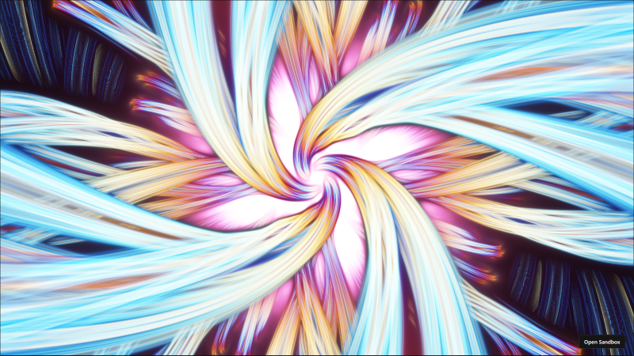

# Shader Adventures in Rust: WebGPU + WebAssembly

>**AI Transparency:** I used an AI assistant to help polish the text and code comments in this post. Everything else—the Rust code, WebGPU logic, and original content—was written by me. The fragment shader started out as GLSL by Mårten Rånge, and I converted it to WGSL myself.


Graphics rendering has been a passion for decades, beginning in the early 1990s with experiments on the **Commodore 64** and evolving through **WebGL/OpenGL** to today’s modern graphics APIs. While high-performance graphics has always been a central focus, 2019 marked the start of my **Rust journey**, building the first dedicated **shader renderer in Rust** and exploring new possibilities in real-time rendering. Since then, the ecosystem has matured, opening opportunities to experiment with **WebGPU** across Rust, JavaScript/TypeScript, and other environments.

This project brings those experiences together: a **full-screen shader renderer** powered by Rust for performance-critical logic and the modern **WebGPU** API for real-time graphics in the browser. The demo features a **time-animated fractal**, compiled to **WebAssembly (Wasm)**, highlighting both Rust’s performance and the versatility of WebGPU.

This tutorial provides the complete source code along with step-by-step guidance, making it easy to build, run, and deploy the demo—and explore the fascinating world of shaders in the browser.


*Run the example here [https://ks6r3k.csb.app/](https://ks6r3k.csb.app/)*

## 1. Project Setup: The Wasm-Graphics Foundation

The project relies on a **minimal `Cargo.toml` configuration** to define the project metadata and list the key dependencies needed for this graphics demo. These crates bridge **Rust** with the web’s graphics and event-handling system, enabling **WebGPU rendering** and **Wasm integration**.


### Dependencies (`Cargo.toml`)

```toml
[package]
name = "wasm_graphics_demo"
version = "0.1.0"
edition = "2024"

[lib]
crate-type = ["cdylib", "rlib"]

[dependencies]
# WebAssembly Bindings & Web APIs
wasm-bindgen = "0.2"
js-sys = "0.3"
web-sys = { version = "0.3", features = [
    "Window",
    "Document",
    "HtmlCanvasElement",
    "console",
] }

# Windowing and Event Handling
winit = "0.30" 

# The main graphics API for Rust
wgpu = "27.0" 

# Async runtime for Wasm and data sharing
pollster = "0.3"
bytemuck = { version = "1.19", features = ["derive"] }
wasm-bindgen-futures = "0.4.56"

# Logging (essential for debugging Wasm)
log = "0.4"
console_error_panic_hook = "0.1.7"
console_log = "1.0"

```


## 2. The Rust Application (`src/lib.rs`)

The `lib.rs` file contains the core logic for initialization, state management, and the event-driven render loop.

### Uniform Data Structure

This struct defines the data we send from the CPU to the GPU. The **`bytemuck`** traits ensure its memory layout is compatible with the WGSL uniform block.


```rust
#[repr(C)]
#[derive(Debug, Copy, Clone, bytemuck::Pod, bytemuck::Zeroable)]
struct Uniforms {
    // Resolution (width, height)
    resolution: [f32; 2],
    // Time in seconds since the application started
    time: f32,
    _pad: f32, // Ensures alignment to 16 bytes for f32x4 in WGSL
}

```

### The Graphics State (`State`)

The `State` struct manages all the essential WebGPU resources and logic, including updating the time uniform and handling the rendering commands.

```rust
// ... (omitting State struct definition for brevity)

impl<'a> State<'a> {
    // ... (State::new - Initialization logic)
    
    fn resize(&mut self, new_size: winit::dpi::PhysicalSize<u32>) {
        if new_size.width > 0 && new_size.height > 0 {
            // Update the WGPU surface configuration
            self.config.width = new_size.width;
            self.config.height = new_size.height;
            self.surface.configure(&self.device, &self.config);
            // Update resolution uniform
            self.uniforms.resolution = [new_size.width as f32, new_size.height as f32];
        }
    }

    fn update(&mut self) {
        let current_time = js_sys::Date::now();
        // Calculate elapsed time and update the Uniforms struct
        self.uniforms.time = ((current_time - self.start_time) / 1000.0) as f32;
        // Write updated uniforms to the GPU buffer
        self.queue.write_buffer(
            &self.uniform_buffer,
            0,
            bytemuck::cast_slice(&[self.uniforms]),
        );
    }
    
    fn render(&mut self) -> Result<(), wgpu::SurfaceError> {
        self.update();
        let output = self.surface.get_current_texture()?;
        let view = output.texture.create_view(&wgpu::TextureViewDescriptor::default());
        let mut encoder = self.device.create_command_encoder(&wgpu::CommandEncoderDescriptor {
            label: Some("Render Encoder"),
        });
        {
            let mut render_pass = encoder.begin_render_pass(/* ... */);
            render_pass.set_pipeline(&self.render_pipeline);
            render_pass.set_bind_group(0, &self.uniform_bind_group, &[]);
            // Draw 3 vertices for the fullscreen triangle
            render_pass.draw(0..3, 0..1); 
        }
        self.queue.submit(std::iter::once(encoder.finish()));
        output.present();
        Ok(())
    }
}

```

### WASM Entry Point and Event Loop

The `#[wasm_bindgen(start)]` function is the asynchronous entry point for the Wasm module.

```rust
#[wasm_bindgen(start)]
pub async fn run_wasm() {
    // ... (WASM setup, Winit EventLoop, and DOM attachment using web_sys)

    // Leak window to get static lifetime for State (required by winit)
    let window: &'static Window = Box::leak(Box::new(window));
    let state = State::new(window).await;

    // Runner implements the ApplicationHandler trait to handle window events and redraws
    struct Runner { state: State<'static> }
    impl ApplicationHandler for Runner {
        // ... (window_event handling for Resized and RedrawRequested)
    }
    
    // Start the event loop
    event_loop.run_app(&mut Runner { state }).unwrap();
}

```

## 3. The WebGPU Shaders (WGSL)

The true artistry resides in the shaders, which are the core rendering logic executed directly on the GPU.

### The Vertex Shader (`vertex.wgsl`)

This shader uses a common technique to cover the entire viewport by defining three vertices that form a triangle spanning the Normalized Device Coordinates ($[-1, 1]$).

```glsl
// ... (Uniforms struct)

@vertex
fn vs_main(@builtin(vertex_index) vertexIndex: u32) -> VertexOutput {
    // ... (Position array logic)
    // ...
    // Calculate normalized texture coordinates (0.0 to 1.0)
    // ...
    return output;
}

```

### The Fragment Shader (`fragment.wgsl`)

This WGSL shader, a version of [Super String Theory](https://www.shadertoy.com/view/tf3SWB)
 by Mårten Rånge, generates a dynamic, colorful fractal-like visualization. It computes the color of each pixel by raymarching through a 3D space, creating swirling, repeating patterns that evolve over time based on the uniform time and the pixel’s screen coordinates.

```glsl
// ---------------------------
// Uniforms
// ---------------------------
struct Uniforms {
    resolution: vec2<f32>,
    time: f32,
};

@group(0) @binding(0)
var<uniform> uniforms: Uniforms;

// ---------------------------
// Vertex Output
// ---------------------------
struct VertexOutput {
    @builtin(position) pos: vec4<f32>,
    @location(0) uv: vec2<f32>,
};

// ---------------------------
// Helper Functions
// ---------------------------

// Creates a 2D rotation matrix for the given angle (theta)
fn rotation2D(theta: f32) -> mat2x2<f32> {
    let c = cos(theta);
    let s = sin(theta);
    return mat2x2<f32>(vec2<f32>(c, s), vec2<f32>(-s, c));
}

// Smooth Minimum function (unused in mainImage, but provided in original context)
fn smin(a: f32, b: f32, k: f32) -> f32 {
    let h = clamp(0.5 + 0.5 * (b - a) / k, 0.0, 1.0);
    return mix(b, a, h) - k * h * (1.0 - h);
}

// ---------------------------
// Fractal / Raymarch Function
// ---------------------------
fn mainImage(uv: vec2<f32>) -> vec4<f32> {
    var O: vec4<f32> = vec4<f32>(0.0);

    let t: f32 = uniforms.time;
    let aspect: f32 = uniforms.resolution.x / uniforms.resolution.y;
    
    // Normalize UV to screen space centered at zero and apply aspect ratio correction
    var C: vec2<f32> = vec2<f32>(uv.x * aspect - 0.5 * aspect, uv.y - 0.5);

    var d: f32 = 1.0; 
    var s: f32 = 1.0; 
    var j: f32 = 1.0; 
    var z: f32 = 0.0; 
    var N: f32 = 0.0; 
    var D: f32 = 0.0; 
    var k: f32 = 1.0; 
    
    var p: vec4<f32> = vec4<f32>(0.0); 
    var o: vec4<f32> = vec4<f32>(0.0); 
    
    let U: vec4<f32> = vec4<f32>(3.0, 1.0, 2.0, 0.0); 

    // Main raymarch loop
    for(var i: f32 = 0.0; i < 70.0; i = i + 1.0) {
        z = fma(0.5, d, z) + 0.001;

        // 3D ray direction
        var ray_dir: vec3<f32> = normalize(vec3<f32>(C, 1.0));
        p = vec4<f32>(z * ray_dir, 0.0);

        p.z = p.z - 3.0; 

        // Sphere Inversion / Folding (Fractal Iteration)
        k = 16.0 / dot(p.xyz, p.xyz);
        p = p * k;

        var q: vec2<f32> = p.xy;

        // Tiling/Repetition
        q = q - round(q / 5.0) * 5.0;

        // Calculate rotation angle based on time and distance factor (k)
        let angle = fma(0.5, t, log2(k));
        let R = rotation2D(angle);

        d = 1.0;
        s = 1.0;

        // Inner Distance Field refinement loop
        for(j = 1.0; j < 6.0; j = j + 1.0) {
            s = fma(s, 0.5, 0.0);
            q = abs(q * R) - vec2<f32>(1.5 * s / j);
            D = length(q) - s / 8.0;

            if(D < d) {
                N = j; 
                d = D; 
            }
        }

        // Final distance estimation for this step, scaled by the fractal factor k
        d = abs(d) / k;

        // Color modulation
        p = vec4<f32>(1.0) + sin(vec4<f32>(p.z + U.z, p.z + U.y, p.z + U.w, p.z + U.z) - t + N);

        // Calculate color contribution
        let color_contribution: vec4<f32> = vec4<f32>(p.xyz, 1.0) / max(d, 0.001);
        
        // Add a glow/bloom effect
        let glow_effect: vec4<f32> = exp(0.3 * k) * 6.0 * U;

        // Accumulate color
        o = o + color_contribution + glow_effect;
    }

    // Apply Tonemapping (tanh)
    O = tanh(o / 30000.0);
    return O;
}

// ---------------------------
// Fragment Shader Entry Point
// ---------------------------
@fragment
fn main_fragment(in: VertexOutput) -> @location(0) vec4<f32> {
    // The fragment shader uses the interpolated UV from the vertex shader
    return mainImage(in.uv);
}

```

## 4. Building and Deployment with `wasm-pack`

To take the Rust code and turn it into a browser-ready application, we use the **`wasm-pack`** toolchain.

### The Build Command

In your terminal, from the project root directory, execute:

```
wasm-pack build --target web
```

This command compiles the Rust code to:

1.  A WebAssembly binary (`wasm_graphics_demo_bg.wasm`).    
2.  A JavaScript **glue file** (`wasm_graphics_demo.js`) that handles initialization and communication between JavaScript and Wasm.
    

### Source Code and Live Demo

You can view the complete, working source code and run the demo directly in your browser:

-   **GitHub Repository (Full Source):** [https://github.com/MagnusThor/wasm_graphics_demo](https://github.com/MagnusThor/wasm_graphics_demo)
    
-   **CodeSandbox Live Preview:** [https://ks6r3k.csb.app/](https://ks6r3k.csb.app/)
    
-   **CodeSandbox Project Link:** [https://codesandbox.io/p/sandbox/ks6r3k](https://codesandbox.io/p/sandbox/ks6r3k)

- **Super string theory** by Mårten Rånge [https://www.shadertoy.com/view/tf3SWB](https://www.shadertoy.com/view/tf3SWB) 
    
----------

*Thank you for reading, and I wish you a joyful advent.
Magnus*