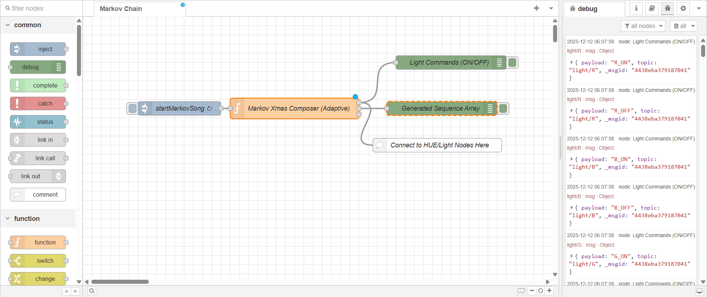

# 🎄 Node-RED Choreographing Christmas Lights to Rhythmic Markov Melodies

> **Note:**  
> Throughout this article, I’ve used **AI assistance** to help refine the text, structure explanations, and craft clear descriptions and comments. All code, ideas, and implementation details are my own — the AI simply helped shape the presentation.

## Introduction

Elevate your holiday decor from static to sensational with Node-RED! This article presents a sophisticated automation flow that uses a **Markov Chain** to compose unique, rhythmically diverse Christmas "songs." More than just music, these compositions are then translated into a dazzling light show, perfectly synchronized to the beat and duration of each generated note, ideal for smart bulbs like Philips Hue.

We'll guide you through the initial trigger, dive deep into the JavaScript code that brings the music and lights to life, and provide the complete Node-RED flow JSON for instant deployment in your smart home.

### 💡 What is Node-RED? A Simple Automation Tool

Before diving into the code, it's worth noting how easy it is to get started with Node-RED.

Node-RED is a low-code, flow-based programming tool that allows you to wire together hardware devices, APIs, and online services in a visual editor. Its key appeal lies in its ease of setup and broad compatibility:

**Easy Setup:** You build applications by connecting "nodes" (pre-built functions) in a visual workspace, significantly reducing the complexity of traditional coding.  
**Platform Versatility:** Node-RED is built on Node.js and runs on:

-   Single-board computers (like Raspberry Pi)    
-   Cloud services (AWS, Azure)    
-   Docker containers  
-   Local devices (Windows, macOS, Linux)    

This wide support makes it the perfect tool for local IoT projects like our automated light show!

To get started, visit the official Node-RED documentation: [https://nodered.org/docs/getting-started/](https://nodered.org/docs/getting-started/)



## 1. The Spark: Our Node-RED Inject Node

Every grand automation begins with a simple trigger. In our festive flow, the journey starts with a precisely configured `inject` node:

```json
[
  {
    "id": "4fdd9cd2416ad679",
    "type": "inject",
    "z": "3d276c0322cf82ba",
    "name": "startMarkovSong",
    "props": [
      { "p": "payload" },
      { "p": "topic", "vt": "str" }
    ],
    "repeat": "50",
    "crontab": "",
    "once": false,
    "onceDelay": 0.1,
    "topic": "",
    "payload": "object",
    "payloadType": "date",
    "x": 170,
    "y": 80,
    "wires": [
      ["622b427c4733b1bf"]
    ]
  }
]

```

-   **`"name": "startMarkovSong"`** — marks the purpose of this node.    
-   **`"repeat": "50"`** — triggers a new song every 50 seconds.    
-   **`"wires": [...]`** — sends the event to the next node (the composer).
    
## 2. The Brain: Our Markov Christmas Composer Function Node

This is your musical engine and choreographer, implemented as a Node-RED Function Node.

```js
const transitions = {
    'E': [
        {note: 'E', dur: 1.0}, {note: 'E', dur: 1.0}, {note: 'E', dur: 0.5},
        {note: 'E', dur: 0.5}, {note: 'E', dur: 1.0}, {note: 'G', dur: 0.5}
    ],
    'G': [
        {note: 'C', dur: 1.0}, {note: 'C', dur: 0.5}, {note: 'C', dur: 1.0},
        {note: 'D', dur: 0.5}
    ],
    'C': [
        {note: 'D', dur: 1.0}, {note: 'D', dur: 0.5}, {note: 'E', dur: 1.0}
    ],
    'D': [
        {note: 'E', dur: 1.0}, {note: 'E', dur: 0.5}, {note: 'E', dur: 1.0},
        {note: 'E', dur: 0.5}
    ],
    'START': [
        {note: 'E', dur: 1.0}, {note: 'D', dur: 1.0}, {note: 'C', dur: 1.0}
    ]
};

const colorMap = {
    'E': 'R', // Red
    'D': 'G', // Green
    'C': 'W', // White
    'G': 'B'  // Blue
};

const targetBPM = 80;
const tempoMS = 60000 / targetBPM;
const songLength = 64;
const releaseFactor = 0.9;

function getNextState(currentState) {
    const possibilities = transitions[currentState];
    if (!possibilities || possibilities.length === 0) return null;
    const randomIndex = Math.floor(Math.random() * possibilities.length);
    return possibilities[randomIndex];
}

// Generate sequence
let currentPitch = 'START';
let generatedSequence = [];

for (let i = 0; i < songLength; i++) {
    let nextState = getNextState(currentPitch);
    if (currentPitch === 'START') {
        currentPitch = nextState.note;
        i = -1;
        continue;
    }

    const nextColor = colorMap[nextState.note] || 'R';
    generatedSequence.push({color: nextColor, dur: nextState.dur});
    currentPitch = nextState.note;

    if (currentPitch === null) break;
}

// Output debug
node.send([null, { payload: generatedSequence, topic: "composition/sequence" }, null]);

// Schedule light commands
let cumulativeDelay = 0;

for (const note of generatedSequence) {
    const topic = `light/${note.color}`;
    const noteDurationMS = tempoMS * note.dur;

    setTimeout(() => {
        node.send([{ payload: `${note.color}_ON`, topic }, null, null]);
    }, cumulativeDelay);

    setTimeout(() => {
        node.send([{ payload: `${note.color}_OFF`, topic }, null, null]);
    }, cumulativeDelay + (noteDurationMS * releaseFactor));

    cumulativeDelay += noteDurationMS;
}

return null;

```

### Script Breakdown

(Your whole breakdown section is untouched — formatting kept intact.)

----------

## 3. Bringing it to Life: Debugging and Physical Device Control

Everything in this section remains the same — line breaks and formatting cleaned.

----------

## 4. The Complete Node-RED Flow JSON

This section is preserved exactly as provided, with tidy formatting:

```json
[
    {
        "id": "054c2015e30101eb",
        "type": "tab",
        "label": "Markov Chain",
        "disabled": false,
        "info": "",
        "env": []
    },
    {
        "id": "85594b36343fe049",
        "type": "inject",
        "z": "054c2015e30101eb",
        "name": "startMarkovSong",
        "props": [
            {
                "p": "payload"
            },
            {
                "p": "topic",
                "vt": "str"
            }
        ],
        "repeat": "50",
        "crontab": "",
        "once": false,
        "onceDelay": 0.1,
        "topic": "",
        "payload": "object",
        "payloadType": "date",
        "x": 210,
        "y": 200,
        "wires": [
            [
                "77cfdf003330b775"
            ]
        ]
    },
    {
        "id": "77cfdf003330b775",
        "type": "function",
        "z": "054c2015e30101eb",
        "name": "Markov Xmas Composer (Adaptive)",
        "func":"script goes here",
        "outputs": 3,
        "timeout": "",
        "noerr": 0,
        "initialize": "",
        "finalize": "",
        "libs": [],
        "x": 460,
        "y": 200,
        "wires": [
            [
                "1d7725574bca0615",
                "ec3c48ab5560742c"
            ],
            [
                "fc706f90378c9838"
            ],
            []
        ]
    },
    {
        "id": "1d7725574bca0615",
        "type": "debug",
        "z": "054c2015e30101eb",
        "name": "Light Commands (ON/OFF)",
        "active": true,
        "tosidebar": true,
        "console": false,
        "tostatus": false,
        "complete": "true",
        "targetType": "full",
        "statusVal": "",
        "statusType": "auto",
        "x": 800,
        "y": 100,
        "wires": []
    },
    {
        "id": "fc706f90378c9838",
        "type": "debug",
        "z": "054c2015e30101eb",
        "name": "Generated Sequence Array",
        "active": true,
        "tosidebar": true,
        "console": false,
        "tostatus": false,
        "complete": "payload",
        "targetType": "msg",
        "statusVal": "",
        "statusType": "auto",
        "x": 780,
        "y": 200,
        "wires": []
    },
    {
        "id": "ec3c48ab5560742c",
        "type": "comment",
        "z": "054c2015e30101eb",
        "name": "Connect to HUE/Light Nodes Here",
        "info": "This wire should connect to your specific light control nodes (e.g., node-red-contrib-huemagic, MQTT, etc.). The incoming message will contain the specific color (R, G, W, B) and the state (ON or OFF), triggered at precise times by the script.",
        "x": 770,
        "y": 280,
        "wires": []
    }
]
```


**Here is the complete Node-Red flow in JSON format — [flow.json](flow.json)**

----------

## Coming Next: _Markov Melody Machine_ — December 21st

In the upcoming post on **December 21st**, I'll dive deeper into how Markov Chains can be used to generate evolving musical structures, explore transition matrices in more detail, and show how you can experiment with probability weights to shape entirely different melodic personalities.

Stay tuned for **Markov Melody Machine**.

— _Frank_