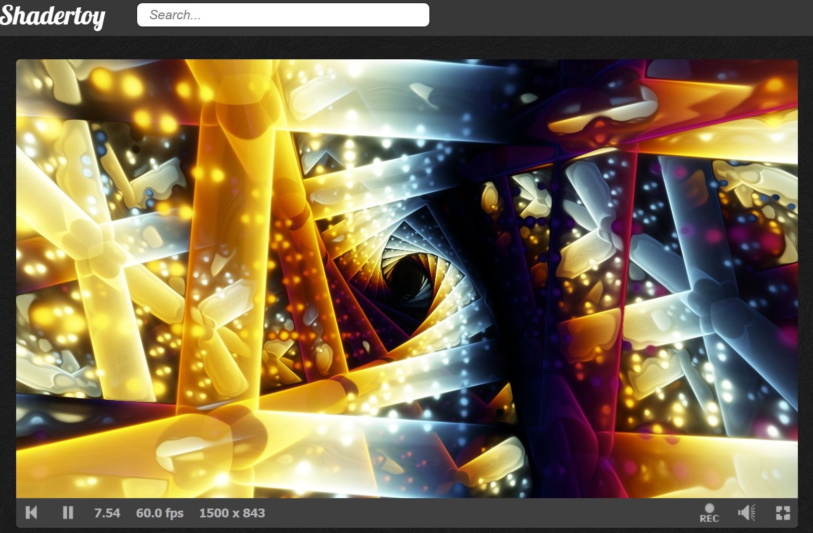

> 💡 AI Transparency Disclosure: I used an AI assistant to polish up the text in this post. The code itself, and the initial, unrevised content of the blog post, were entirely written by me.

# 🎄 Disassembling a Compact Glow-Tracer 💡

**Intended audience:** Shader developers curious about writing tiny, colorful shaders.

## What is a Glow-Tracer?

**The Core Idea:** When we march through space and get close to a surface (small `d`), dividing color by `d` produces increasingly bright values. Far from surfaces, `d` is large, so the color contribution is tiny. This creates the characteristic glow effect.

Last year, I became interested in writing **glow-tracers** because they can look striking, with vibrant colors against a black background. They can also be made tiny and are quick to write.

I thought I’d share some of the tricks I’ve learned over the year, and show how to take a minified glow-tracer and break it down into understandable parts. A useful skill when learning from other compact glow-tracers.

## Mission Impossible: The Obfuscated Compact Shader

Say you find a compact shader like this. How do you even begin to decrypt it?

```glsl
void mainImage(out vec4 O,vec2 C){float i,d,z;vec4 o,p,P,D;for(vec2 r=iResolution.xy;++i<77.;z+=.7*d+1E-3)p=z*normalize(vec3(C-.5*r,r.y)).xyzx,p.z+=.5*iTime,p.xy*=mat2(cos(.3*p.z+vec4(0,11,33,0))),p.xy-=.5,P=p,p=abs(p-round(p)),D=sin(25.*p),d=abs(min(min(p.x,p.y)+4E-3+.05*D.x*D.y*D.z,min(length(p.zy),min(length(p.xy),length(p.xz)))-.1)),p=1.+sin(.5*P.z+5.*P.y+vec4(0,1,2,0)),o+=p.w*p/max(d,1E-3);O=tanh(o/2E4);}
```

Try it yourself on [ShaderToy](https://www.shadertoy.com/new).


It should look something like this.

## Step 1: Reformatting for Readability

First, format the code for readability. Tools like `clang-format` or GLSL plugins for Visual Studio Code can help, but I used an AI assistant for this.

> **Note:** Shadertoy does not count whitespace or comments toward the overall byte count, which allows us to write readable code while still aiming for the smallest possible size.

```glsl
void mainImage(out vec4 O, vec2 C) {
  float i, d, z;
  vec4 o, p, P, D;

  for(vec2 r = iResolution.xy; ++i < 77.; z += .7 * d + 1E-3)
    p = z * normalize(vec3(C - .5 * r, r.y)).xyzx,
    p.z += .5 * iTime,
    p.xy *= mat2(cos(.3 * p.z + vec4(0, 11, 33, 0))),
    p.xy -= .5,
    P = p,
    p = abs(p - round(p)),
    D = sin(25. * p),
    d = abs(min(min(p.x, p.y) + 4E-3 + .05 * D.x * D.y * D.z,
          min(length(p.zy), min(length(p.xy), length(p.xz))) - .1)),
    p = 1. + sin(.5 * P.z + 5. * P.y + vec4(0, 1, 2, 0)),
    o += p.w * p / max(d, 1E-3);

  O = tanh(o / 2E4);
}
```

## Step 2: Understanding the Setup

Small shaders often pack single-letter variables upfront to save bytes. Variables get reused for different purposes. Readability suffers, size benefits.

> **⚠️ Code-Golfing Note on Initialization**
> The GLSL standard does not guarantee that local variables are initialized to zero, but most GPU environments do. Size coders accept this risk to save bytes, since otherwise we would have to spend bytes on statements like `z=0.;` or `o=vec4(0);`.

| Variable | Type | Primary Purpose |
| :--- | :--- | :--- |
| `i` | `float` | Loop counter/Iteration variable |
| `d` | `float` | Distance field value (distance to surface) |
| `z` | `float` | Ray depth (distance traveled along the ray) |
| `o` | `vec4` | Output color accumulator (total radiance) |
| `p` | `vec4` | Current ray position in 4D space |
| `P` | `vec4` | Backup of `p` (used for color calculation) |
| `D` | `vec4` | Sine distortion vector for the distance field |

## Step 3: Deconstructing the Loop

```glsl
for(vec2 r = iResolution.xy; ++i < 77.; z += .7 * d + 1E-3)
```

### Initialization: Saving a Semicolon

`vec2 r = iResolution.xy;` initializes the `r` (resolution) variable here instead of before the loop. This saves a semicolon, a common code-golfing trick.

### Condition: Merging Increment and Loop Condition

`++i < 77.` merges the increment and the loop condition of the `for` loop, also a very common technique in code golfing.

### Iteration: Ray Advance

`z += .7 * d + 1E-3;` advances the ray based on the distance `d` to the nearest object. The `.7` factor helps to prevent overstepping, a common issue when the distance field is heavily distorted. The `+ 1E-3` term ensures the ray always moves forward, even near edges. Crucially, a glow-tracer is designed to step **through** the object to accumulate color.

### Code-Golfing Trick: The Comma Operator

You'll notice most of the loop body is a single, multi-line expression separated by commas (`,`) instead of semicolons (`;`). This allows the entire complex logic to run as the loop's "single statement," avoiding the need for curly braces (`{}`) and saving two bytes.

## Step 4: Ray Setup and World Twisting

The first few lines inside the loop set up the ray and apply an appealing world twisting effect:

```glsl
p = z * normalize(vec3(C - .5 * r, r.y)).xyzx,
p.z += .5 * iTime,
p.xy *= mat2(cos(.3 * p.z + vec4(0, 11, 33, 0))),
p.xy -= .5,
```

### Computing the Ray Direction

The expression `normalize(vec3(C - .5 * r, r.y))` is a compact way to compute a ray direction. It centers the coordinate (`C - .5 * r`) and uses the vertical resolution (`r.y`) for the implicit field of view(FOV). We then multiply by the ray depth `z` to get the world position and expand to 4D using `.xyzx` (I often start with 4D in hopes of cool effects, though it didn't pan out here).

### The Many Ways to Initialize Ray Direction

There are many variants for setting up the ray direction. Here's another one that avoids the `r` variable:

`normalize(vec3(C+C,0)-iResolution.xyy)`

It looks in the opposite direction with a wider FOV. If that works for your scene, you save a few bytes.

### Animation

`p.z += .5 * iTime` animates the world position forward along the Z-axis.

### Twisting the World

`p.xy *= mat2(cos(.3 * p.z + vec4(0, 11, 33, 0)))` twists the X/Y plane based on the ray's depth (`p.z`).

### 🤯 The Rotation Matrix Code-Golf

The most fascinating part of the code here is the approximate rotation matrix:
```glsl
mat2(cos(a + vec4(0, 11, 33, 0)))
```

This trick is used all the time in tiny shaders, and it’s my favorite one I learned this year.

Normally, a rotation matrix is `mat2(cos(a), sin(a), -sin(a), cos(a))`.

Note that:

  * $11 \approx 3.5 \pi$
  * $33 \approx 10.5 \pi$

Using trigonometric identities, $\cos(a + \frac{\pi}{2}) = -\sin(a)$, and $\cos(a - \frac{\pi}{2}) = \sin(a)$. Because of the $2\pi$ periodicity, the constants 11 and 33 are used as offsets that *approximate* the necessary $\pm\frac{\pi}{2}$ shifts, effectively generating $\sin(a)$ and $-\sin(a)$ terms needed for the matrix, all with a single `cos()` call.

## Step 5: Domain Repetition and Distance Field

Next, we prepare the coordinate system and compute the distance field (`d`):
```glsl
P = p,
p = abs(p - round(p)),
D = sin(25. * p),
d = abs(min(min(p.x, p.y) + 4E-3 + .05 * D.x * D.y * D.z,
            min(length(p.zy), min(length(p.xy), length(p.xz))) - .1)),
```

### Backup and Tiling

**Backup:** `P = p` saves the current world position, which is needed later for coloring.

**Domain Repetition:** `p = abs(p - round(p))` is a classic short expression for domain repetition. `p - round(p)` wraps the coordinates back into the range $[-0.5, 0.5]$. The subsequent `abs()` folds the space into the range $[0, 0.5]$, which is necessary for the distance field calculation that follows.

**Distortion:** `D = sin(25. * p)` creates a high-frequency sine wave based on the position.

### The Distance Field Geometry

The distance field `d` defines our geometry. Breaking down the components:

#### The Cross Pattern
```glsl
min(length(p.zy), min(length(p.xy), length(p.xz))) - .1
```

This creates three intersecting cylinders along the X, Y, and Z axes (a 3D cross shape). `length(p.xy)` is a cylinder along the Z-axis, and so on. The `-.1` sets the radius.

#### The Planes
```glsl
min(p.x, p.y)
```

These are planes perpendicular to the X and Y axes. In the folded domain created by `abs(p - round(p))`, these become the box edges of each repeated cell.

#### Adding Detail with Sine
```glsl
+ .05 * D.x * D.y * D.z
```

The product of the three sine distortion components creates the cool floating dot pattern.

#### Final Combination
```glsl
d = abs(min( ... ))
```

We take the minimum of the cross and the planes to combine them into one shape. The final `abs()` turns solid objects into thin, glowing shells. This is a signature move of a glow-tracer.

## Step 6: Color Generation and Accumulation

Now we compute the color and accumulate the total light hitting the pixel:
```glsl
p = 1. + sin(.5 * P.z + 5. * P.y + vec4(0, 1, 2, 0)),
o += p.w * p / max(d, 1E-3);
```

### Palette Generation

`1. + sin(A + vec4(0, 1, 2, 0))` is another glow-tracer staple for producing pleasing color palettes. The offset
`A = 0.5 * P.z + 5.0 * P.y` makes the colors vary with world position (`P`).

### Accumulation

`o += ...` adds the color to the accumulator `o` at every step. We divide by `d` (the distance to the surface) to make the glow brighter near the surface. `p.w` (the 4th color channel) controls the luminosity of the glow. `max(d, 1E-3)` prevents division by zero when the ray is exactly on a surface.

## Step 7: Final Output

```glsl
O = tanh(o / 2E4);
```

The accumulated color `o` is likely a blinding white value. We divide it by a large constant (`2E4`) to scale it down into a visible range. The `tanh` function is then used as a compact **tone-mapping** operator to compress the wide range of accumulated light values into the $[0, 1]$ range for the screen.

> **⚠️ `tanh` on MacBook M-series**
> On MacBook M-series GPUs, `tanh` can produce color artifacts for large input values. If you run into this, a simple clamp usually fixes it: `tanh(clamp(col, 0., 5.))`.

## That's It!

Color accumulation at each step, weighted by distance, is what makes this a glow-tracer. The constants were derived by trial and error, with minimal overthinking. The ray direction and rotation-matrix tricks are fundamental techniques found in most compact shaders, often tweaked to squeeze out every last byte.

Another cool thing with glow-tracers is that you can really abuse the distance field, such as [Xor's](https://www.shadertoy.com/user/Xor) turbulence formula. If it looks bad, try a smaller step value.

Speaking of [Xor](https://www.shadertoy.com/user/Xor), that is one of the people you should follow on ShaderToy for small shaders. [FabriceNeyret2](https://www.shadertoy.com/user/FabriceNeyret2) is another extremely skilled size coder. It's not uncommon that I spend an evening optimizing my shader, only for them to find like 30 more chars to remove upon publishing. I honestly felt I did a pretty good job, but that's how skilled [FabriceNeyret2](https://www.shadertoy.com/user/FabriceNeyret2) is!

🫶 [mrange](https://www.shadertoy.com/user/mrange) 🫶

## 🎄 What's Under the Christmas Tree? 🎁

I've learned a few tricks since writing the original. Applying them:

**Trick 1: Reuse output variables**
We can use `O` instead of declaring `P`, since `O` isn't needed until the end.

**Trick 2: Fuse operations**
Combining `z +=` and `d =` in one expression saves bytes. Watch: `z += d = ...`

**Trick 3: Replace max with addition**
When preventing division by zero, `d + 1e-3` works similarly to `max(d, 1e-3)` and saves chars.

Result: 413 → 399 bytes. I bet there are still a few bytes hiding in there. Can you help me find them?

```glsl
void mainImage(out vec4 O, vec2 C) {
  float i, d, z;
  vec4 o, p, D;

  for(vec2 r = iResolution.xy; ++i < 77.; o += p.w * p / d)
    p = z * normalize(vec3(C - .5 * r, r.y)).xyzx,
    p.z += .5 * iTime,
    p.xy *= mat2(cos(.3 * p.z + vec4(0, 11, 33, 0))),
    p.xy -= .5,
    O = p, // O now temporarily holds the un-tiled position
    p = abs(p - round(p)),
    D = sin(25. * p),
    // Fused advance (z += d) and distance calculation (d = ...)
    z += d = 8E-4+.7*abs(min(min(p.x, p.y) + 4E-3 + .05 * D.x * D.y * D.z,
          min(length(p.zy), min(length(p.xy), length(p.xz))) - .1)),
    // Color computation uses O instead
    p = 1. + sin(.5 * O.z + 5. * O.y + vec4(0, 1, 2, 0))
    ;

  O = tanh(o / 2E4);
}
```
