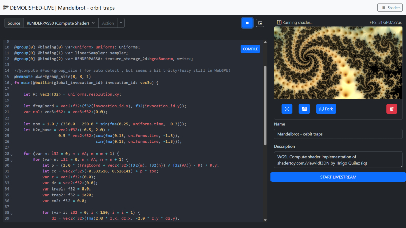
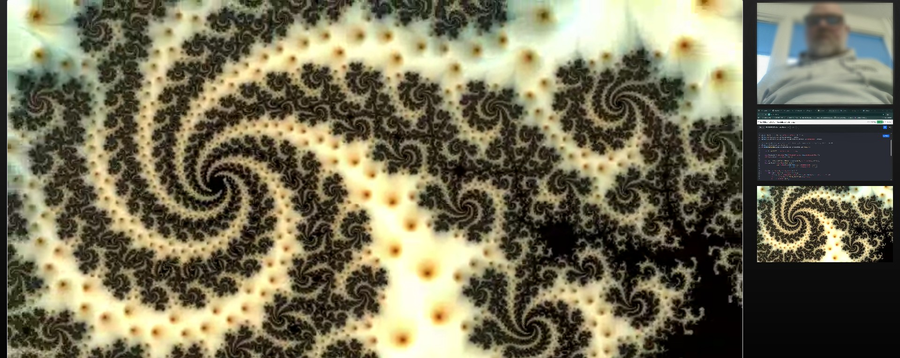

# Building a Real-Time WGSL Shader Playground with WebGPU and WebRTC

Category: **🌐 Web Projects**

I've built a [live-coding environment](https://github.com/MagnusThor/demolished-live-code) that lets the user instantly compile WebGPU Shading Language (WGSL) directly from the editor, render the result to a canvas, and broadcast that canvas output in real-time using WebRTC.  This post briefly describes the building blocks that makes this ambitious real-time workflow possible. The source code is shared in total in an external repository. (found later on in this post)

The editor can be tested at the following URL: [https://magnusthor.github.io/demolished-live-code/public/](https://magnusthor.github.io/demolished-live-code/public/)*(Note: Live stream features require cloning the repository and running the server locally or in your own server environment).*



### **Stack Highlights:**

I built this application using JavaScript/Node.js stack, leveraging key low- browser APIs:

| Component           | Technology                               | Role                                                                 |
|---------------------|------------------------------------------|----------------------------------------------------------------------|
| Backend / Signaling | Node.js, Express, `thor-io.vnext`         | Handles initial WebRTC signaling for peer connections                |
| Editor / UI         | CodeMirror 6, TypeScript                  | Provides the **WGSL editor** with syntax highlighting and manages the compilation loop |
| GPU Engine          | WebGPU, TypeScript (`WGSLShaderRenderer`)             | Compiles and executes the WGSL code on the GPU                        |
| Streaming           | WebRTC, Canvas `captureStream`            | Captures the GPU output and streams it peer-to-peer, combined with mic/cam/screen.                        |


##  The Core Architecture - A Triple Threat

The application's functionality is achieved through the seamless integration of three primary systems/components: the **Code Editor**, the **WebGPU Renderer**, and the **WebRTC Streamer**.

### **A. The Interactive Editor: CodeMirror & Compile Flow**

The editor, built with **CodeMirror 6**, is more than just a text box. It manages the vital parts of development lifecycle / experience.

-   **WGSL Syntax:** I gain robust syntax highlighting and structure by utilizing the Rust language extension (`@codemirror/lang-rust`), given WGSL's strong influence from the Rust programming language.
    
-   **The Compilation Loop (`Editor.onCompile`):** This function is the nerve center of the feedback loop.
    
    1.  The user's code is extracted from the CodeMirror component
    2.  The code is passed to `tryCompile` which calls the crucial GPU validation step:
        
        ```typescript 
        // The real-time compiler check using the WebGPU API
        const shaderModule = this.renderer.device.createShaderModule({ code: source });
        const compileError: IError = {
            // ...
            errors: await shaderModule.getCompilationInfo(),
        }
        
        ```
        
    3.  If `getCompilationInfo()` reports errors, the editor uses a custom decorator to draw immediate visual feedback right next to the corresponding line number.

## The Engine - Dynamic WebGPU Rendering

The `WGSLShaderRenderer` class is responsible for taking the compiled WGSL code and executing it in real-time. The playground supports the entire WebGPU rendering pipeline, enabling both Fragment (rendering) and Compute (data processing) shaders.

### **A. Building the Pipeline (The Main Render Pass) and Multi-Pass Shader Graph**

The core architectural strength lies in the support for a **Multi-Pass Shader Graph**—the ability to dynamically define and combine $1-N$ Compute and Fragment passes into a processing chain. This approach allows for sophisticated, multi-stage effects and GPGPU workflows.

-   **Arbitrary Shader Chaining:** Each pass (whether Compute or Fragment) renders its result to a unique output texture resource (`RENDERPASS0`, `RENDERPASS1`, etc.). This resource can then be bound as a sampler input to any subsequent pass. This creates a flexible graph structure, allowing users to define complex workflows like: **Compute Simulation → Fragment Post-Process → Fragment Final Output.**
    
-   **Final Output Blit:** The final rendering to the canvas is handled by a specialized, simple "Main Fragment" shader. Its primary job is to perform a texture blit—it samples the output texture of the very last pass in the dynamic chain and writes that result to the final presentation canvas. The system dynamically updates the resource binding (`@binding(2) var RENDERPASS0: texture_2d<f32>;`) to point to the correct final texture.
    
    The structure of the final blit shader is:
     
    ```glsl
    // Main Fragment Blit Stage
    struct Uniforms {
      resolution: vec3<f32>,
      time: f32
    };
    @group(0) @binding(0) var screen_sampler : sampler;
    @group(0) @binding(1) var<uniform> uniforms: Uniforms;
    @group(0) @binding(2) var RENDERPASS0: texture_2d<f32>; // Dynamically bound to the final texture in the chain
    
    struct VertexOutput {
      @builtin(position) Position: vec4<f32>,
      @location(0) TexCoord: vec2<f32>
    };
    
    @fragment
    fn main_fragment(@location(0) TexCoord : vec2<f32>,@builtin(position) Position: vec4<f32> ) -> @location(0) vec4<f32> {
      return  textureSample(RENDERPASS0, screen_sampler, TexCoord); 
    }
    
    ```
    
### **B. Executing the Workload (`update` and Compute Dispatch)**

Every frame, the `update` method orchestrates the rendering flow using a `GPUCommandEncoder`.

-   **Compute First:** Compute shaders (added via `addComputeRenderPass`) run first. The work is efficiently distributed by calculating the dispatch size based on the canvas size and the compute shader's workgroup dimensions.
        
    ```typescript
    // Workload distribution for Compute Shaders
    computePassEncoder.dispatchWorkgroups(
        Math.ceil(this.canvas.width / computeRenderPass.workgroupSize!.x),
        Math.ceil(this.canvas.height / computeRenderPass.workgroupSize!.y),
        computeRenderPass.workgroupSize!.z
    );
    
    ```
    
-   **Fragment Rendering:** Subsequently, intermediate fragment shaders and the final 
-  **Main Fragment Blit Stage** execute, drawing the results to the `#result-canvas`.
   

>   Note: Worth looking at is this file in the source code repo  
> [https://github.com/MagnusThor/demolished-live-code/blob/master/src/engine/renderer/webgpu/wgslShaderRenderer.ts](https://github.com/MagnusThor/demolished-live-code/blob/master/src/engine/renderer/webgpu/wgslShaderRenderer.ts)

## Shader Execution Models

The most crucial architectural decision for the `WGSLShaderRenderer` is supporting two fundamentally different execution models: **Compute** and **Fragment** shaders. While both utilize the parallelism of the GPU, they differ in purpose, input, output, and control.

### **A. Compute Shader: Explicit Control and Data Manipulation**

Compute shaders are general-purpose programs executed on the GPU, often used for physics simulation, data processing, or generating textures _before_ or _between_ the rendering stages.

-   **Control:** The developer has explicit control over how the workload is organized using **workgroups**.
    
-   **Input/Output:** Data is typically read from and written to storage buffers or storage textures using explicit functions like `textureLoad` and `textureStore`. The shader below writes its output to `RENDERPASS0`.
    
-   **Thread ID:** The shader uses `@builtin(global_invocation_id)` to know its position in the overall workload grid.
    

**Stub: Compute Shader**

```glsl
@group(0) @binding(2) var RENDERPASS0: texture_storage_2d<bgra8unorm, write>;

@compute @workgroup_size(8, 8, 1) // Dynamic workgroup size applies here
fn main(@builtin(global_invocation_id) invocation_id: vec3u) {
  let R: vec2<f32> = uniforms.resolution.xy;
  let fragCoord = vec2<f32>(f32(invocation_id.x), f32(invocation_id.y));
  var col: vec3<f32> = vec3<f32>(0.0);

  // ... (do the magic) ...

  // Explicitly write the calculated color to the storage texture
  textureStore(RENDERPASS0, invocation_id.xy, vec4<f32>(col, 1.0));
}

```

#### **Dynamic Workgroup Sizing for Usability**

To make the Compute Shader experience seamless, the renderer automatically calculates and injects the `@workgroup_size` attribute if the user omits it. This is done by querying the GPU's supported limits:

```typescript
export const getWorkgroupSizeString = (limits: GPUSupportedLimits): {
    // ...
    workgroup_size: string
} => {
    // Finds a safe power-of-two size, respecting device limits.
    const x = Math.min(16, largestPowerOf2LessThan(limits.maxComputeWorkgroupSizeX));
    const y = Math.min(16, largestPowerOf2LessThan(limits.maxComputeWorkgroupSizeY));
    return {
        x: x, y, z: 1, workgroup_size: `@workgroup_size(${x}, ${y}, 1)`
    };
}

```

### **B. Fragment Shader: Automatic Per-Pixel Execution (Intermediate Pass)**

Fragment shaders are executed as a step in the multi-pass graphics pipeline, specifically for determining the color and properties of a single pixel (or fragment), writing the output to a texture resource for subsequent passes to consume.

-   **Control:** Thread distribution is automatic, dictated by the rendering system (the rasterizer). It executes once per fragment generated by the vertex stage.
    
-   **Input/Output:** The shader's function simply **returns** a color value, and the graphics pipeline automatically writes that color to the current pass's render target (which is typically a texture resource in this multi-pass architecture).
    
-   **Thread ID:** The shader typically uses the `in.pos.xy` coordinate, passed from the vertex shader, to get its screen location.
   

**Stub : Fragment Shader**

```glsl
@fragment
fn main_fragment(in: VertexOutput) -> @location(0) vec4<f32> {
  // Uses the position from the vertex stage to calculate pixel color
  return mainImage(in.pos.xy);
}

fn mainImage(invocation_id: vec2<f32>) -> vec4<f32> {
  let fragCoord = vec2<f32>(f32(location.x), f32(location.y) );
  let uv: vec2<f32> = fragCoord.xy / uniforms.resolution.xy - 0.5;

  // ... (color calculation) ...

  // Returns the calculated color, which is automatically written to the current pass's output texture
  return  vec4<f32>(vec3<f32>(color, color * 0.5, sin(color + time / 3.) * 0.75), 1.);
}
```

### **Summary of Differences**

| Feature            | Compute Shader                                             | Fragment Shader                                              |
|--------------------|-------------------------------------------------------------|--------------------------------------------------------------|
| Purpose            | General-purpose data processing, simulation, texture generation | Coloring pixels (fragments) during the rendering stage       |
| Workload Control   | Explicit via `@workgroup_size` and `dispatchWorkgroups`     | Implicit; automatic per-pixel execution by the rasterizer    |
| Output             | Explicit write to storage textures/buffers using `textureStore` | Implicit return value written automatically to the render target |
| Entry Point        | `@compute fn main(...)`                                     | `@fragment fn main_fragment(...)`                            |


Note: When you run the demo, a set of default shaders will be set up automatically, so i suggest you have a look there if of interest. [https://magnusthor.github.io/demolished-live-code/public/](https://magnusthor.github.io/demolished-live-code/public/)

## Real-Time Broadcast with the `LiveStreamComponent`




Next thing we dig into is the broadcaster, the **`LiveStreamComponent`**, which seamlessly merges the WebGPU output with real-world media streams and broadcasts them using WebRTC.

### **A. Multi-Source Stream Composition**

The `LiveStreamComponent` shows the power of the [MediaStream API](https://developer.mozilla.org/en-US/docs/Web/API/MediaStream) combined with [WebRTC](https://webrtc.org/). It takes multiple distinct sources and combines them into a single local stream for transmission:

1.  **WebGPU Output:** The core shader result is captured as a video track directly from the `#result-canvas` using the `captureStream` method, ensuring the GPU's real-time output is included in the media stream:
     
    ```typescript
    // Capture the WebGPU-rendered canvas output
    const outputVideoTrack = this.compositionCanvas.captureStream(fps).getVideoTracks()[0];
    combinedStream.addTrack(outputVideoTrack);
    
    ```
    
2.  **Webcam & Microphone:** User-selected devices are accessed via standard `navigator.mediaDevices.getUserMedia(constraints)`.
    
3.  **Screen Share:** The entire screen, a window, or a tab is captured using the browser's native prompt via `navigator.mediaDevices.getDisplayMedia`.
    
These individual tracks are then combined into a `combinedStream` which becomes the source for the WebRTC connection.

### **B. WebRTC Transport Architecture (P2P vs. MCU/SFU)**

It is critical to note that the WebRTC connection established here is **Peer-to-Peer (P2P)**. This approach is highly effective for low-latency, secure communication among small, cooperative teams and scenarios where involving third-party media servers is undesirable.

-   **Scalability Consideration:** For large-scale broadcasting (e.g., streaming to dozens or hundreds of spectators), a pure P2P architecture is resource-intensive on the broadcaster's machine.
    
-   **Real-World Evolution:** In a commercial or large-scale broadcast scenario, the architecture would evolve to utilize a **Media Control Unit (MCU)** or a **Selective Forwarding Unit (SFU)**. This media server sits between the broadcaster and the spectators, offloading the load and potentially enabling distribution via standard HTTP video streaming formats (like HLS or DASH). The current P2P model serves as the ideal baseline for small-team collaboration and minimal overhead.    

I use the `thor-io.client-vnext` library and its `WebRTCFactory` to manage the underlying P2P WebRTC connections.

-   The local `combinedStream` is passed to the factory: `this.rtcFactory?.addLocalStream(combinedStream);`
    
-   A unique stream URL is generated using a `streamUUID` for the Spectator view. This URL follows a pattern: `window.location.href}spectate/#${this.streamUUID}`
    
-   The broadcaster joins a dedicated context/room using the UUID: `this.rtcFactory?.changeContext(this.streamUUID);`
    
-   The `rtcFactory` then handles the low-level **Signaling** (SDP Offer/Answer exchange) and initiates the secure, peer-to-peer media transport. The `LiveStreamComponent` is designed purely as a broadcaster, so it expects no remote streams, explicitly logging: `console.log('We will not be receiving any remote streams, but broadcast')`.
    

## The Spectator view - Consuming the Stream

The `SpectatorClient` is responsible for reversing the process: connecting to the signaling server, joining the room defined by the URL hash, and consuming the multi-track stream broadcast by the coder.

### **Initialization and Joining the Context**

The client first parses the `streamUUID` from `location.hash`. It then initializes the `ClientFactory` to connect to the signaling server. The key action is triggered when the user clicks the "JOIN LIVESTREAM" button:

```typescript
// SpectatorClient.render()
DOMUtils.on("click", joinButton, () => {
    this.rtcFactory?.changeContext(this.streamUUID);
    // ...
});

```

Calling `changeContext(this.streamUUID)` instructs the signaling server to connect this spectator client to the dedicated WebRTC room, initiating the SDP handshake to receive the stream.

### **Handling Incoming Media Tracks (`onRemoteTrack`)**

Since the broadcaster sends a single stream containing separate tracks (GPU video, camera video, and audio), the spectator must process each track individually using the `onRemoteTrack` event:

1.  **Video Tracks (GPU/Camera/Screen):** Each video track is wrapped in its own `new MediaStream()`. A thumbnail (`video-thumb`) is rendered in the sidebar for selection. The spectator can click a thumbnail to assign its stream to the main `#selected-video-stream` player.
    
    ```typescript
    this.rtcFactory.onRemoteTrack = (mediaStreamTrack: MediaStreamTrack, remoteConnection: ThorIOConnection, rtcEvent: RTCTrackEvent) => {
        if (mediaStreamTrack.kind === "video") {
            const newMediaStream = new MediaStream();
            newMediaStream.addTrack(mediaStreamTrack);
            this.renderVideoElement(newMediaStream); // Renders the thumbnail
        }
        // ...
    };
    
    ```
    
2.  **Audio Tracks (Microphone):** The audio track is separated and routed directly to a hidden `<audio>` element for playback. The use of `oncanplay` and `play()` handles browser autoplay policies.
    
    ```typescript 
    } else if (mediaStreamTrack.kind === "audio") {
        const audioElement = DOMUtils.get<HTMLAudioElement>("#speaker-audio");
        const audioStream = new MediaStream([mediaStreamTrack]);
        audioElement.srcObject = audioStream;
        audioElement.oncanplay = () => {
            audioElement.play();
        };
    }
    
    ```

### **Stream Lifecycle Management**

The `SpectatorClient` manages the addition and removal of streams using `mediaStreamTrack.onended` and the `handleTrackLost` method. When a track ends (e.g., the coder stops screen sharing or closes the tab), the corresponding thumbnail is removed from the DOM, and the main video player automatically switches to a remaining stream if available, ensuring a robust viewing experience.

The entire system—from the real-time WGSL compilation on the GPU to the peer-to-peer consumption of the composite stream—demonstrates a powerful, low-latency approach to collaborative, live-coded graphics.


## Running the Project Locally

> Note: This is not a complete application, but shows in rough outlines
> how it might work. As time permits, I will clean up and complete with
> the missing things.

The complete source code for this project is available for cloning from this repository
[https://github.com/MagnusThor/demolished-live-code.](https://github.com/MagnusThor/demolished-live-code)
To set up and run the environment locally:

1.  **Clone the Repository:**
    
    ```bash
    git clone https://github.com/MagnusThor/demolished-live-code.git demolished-live-code
    cd demolished-live-code
    
    ```
    
2.  **Install Dependencies:**
    
      
    ```bash
    npm install
    
    ```
    
3.  **Build the Project:** (Note: The project uses TypeScript and Webpack for building, so a dedicated build step is necessary before starting the Node.js server.)
    
       
    ```bash
    npm run build
    
    ```
    
4.  **Start the Server:**
    
       
    ```bash
    npm start
    
    ```
    
This will launch the application on http://localhost:1337, allowing you to experience the real-time WGSL live-coding and streaming environment first-hand.


*Thanks for your time, hope it was interesting and not too confusing
Magnus*