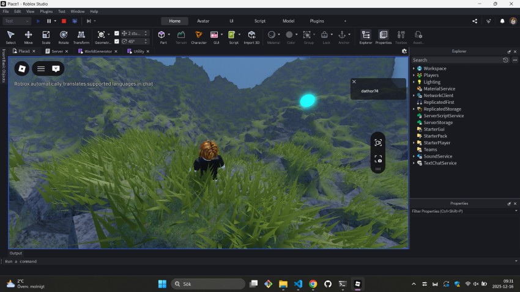
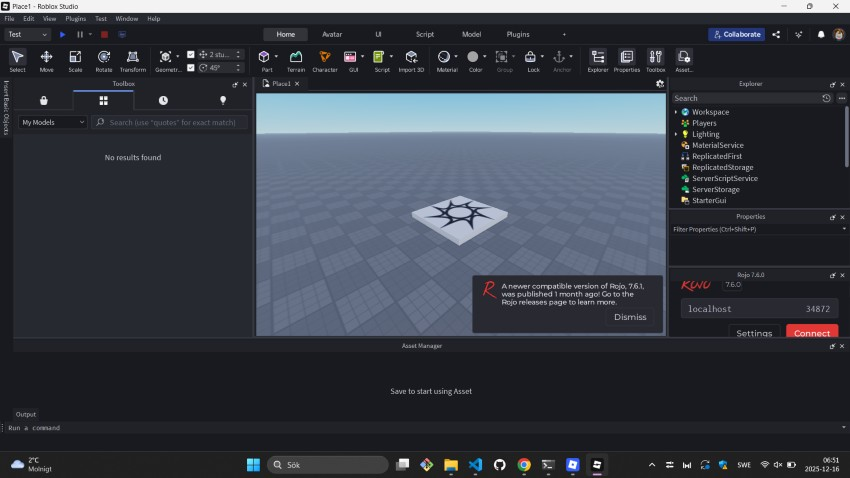
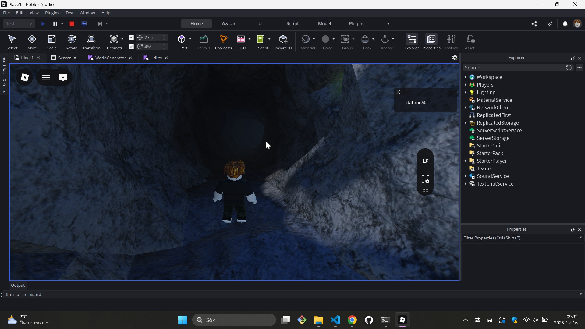

# 🗺️ Building Procedural Worlds in Roblox Using Luau & Rojo

>**AI Transparency:** I used an AI assistant to help polish the text and code comments in this post. Everything else— was written by me. 

This post is a short demo on how to create procedural terrain and random worlds in Roblox. So, why did I choose to share this?

I recently realized how much fun it is to experiment with Roblox after I was asked to lead a series of lectures and teaching sessions at a **"Folk High School"** (a unique Scandinavian educational tradition) with a focus on games and digital entertainment. They wanted me to dive into **Luau** (a language derived from Lua that powers Roblox). What you see here is a subset of the curriculum I developed for those students—demonstrating that with the right tools, you can build complex, infinite worlds with surprisingly simple code.

Starting a procedural generation project in Roblox requires a powerful, organized workflow. The built-in Studio editor is excellent for visual work, but for complex Lua code, a modern IDE like VS Code is superior.

This is where **Rojo**, the developer toolchain, comes in. Rojo ([see rojo.space](https://rojo.space/))  is the bridge that lets you write clean, version-controlled code in VS Code and instantly sync it into Roblox Studio.



## Part 1: Setting up Rojo and VS Code

We'll start with a clean environment, installing the essential tools and connecting your project.

### Step 1: Install Rokit (The Tool Manager)

**Rokit** is the recommended toolchain manager for modern Roblox development. It makes installing and managing tools like Rojo simple and consistent across different projects and team members.

You only need to run a single command in your terminal to install it.

| Operating System | Installation Command |
|------------------|----------------------|
| macOS & Linux    | `curl -sSf https://raw.githubusercontent.com/rojo-rbx/rokit/main/scripts/install.sh` |
| Windows          | `Invoke-RestMethod https://raw.githubusercontent.com/rojo-rbx/rokit/main/scripts/install.ps1` |


> **Note:** After running the command, you may need to **restart your terminal window** to ensure the `rokit` command is correctly recognized.

### Step 2: Prerequisites

Ensure you have the following installed and ready:

1.  **Roblox Studio**    
2.  **Visual Studio Code (VS Code)**    

Here you can find Roblox Studio - https://create.roblox.com/docs/tutorials/curriculums/studio/install-studio)

### Step 3: Install Rojo CLI (The Synchronization Server)

The Rojo command-line tool (CLI) is necessary for creating the project configuration and running the synchronization server. We use Rokit to download it.

1.  **Add Rojo to your project's tool list:**
    
       
    ```bash
    rokit add rojo    
    ```
    
2.  **Download and Install the tools:**
       
    ```bash
    rokit install    
    ```
    
3.  Initialize the Rojo Project:
    
    Open your project folder in VS Code, open the integrated terminal (Ctrl+`), and run:
    
        
    ```bash
    rojo init
    ```
    

### Step 4: Install the VS Code Extension

The extension simplifies the workflow and manages the connection to Studio without needing a separate plugin.

1.  Open **VS Code**.    
2.  Go to the **Extensions** view (`Ctrl+Shift+X`).    
3.  Search for: **`Rojo - Roblox Studio Sync`**    
4.  **Install** the extension.
    

### Step 5: Start Syncing

1.  Start the Server:
    
    In the VS Code terminal, run:   
       
    ```bash
    rojo serve    
    ```
    
    The terminal will show a message like:    
    *Rojo server listening: Address: localhost Port: 34872*
    
**Keep this terminal window running!**

## Part 2: The Project Blueprint and File Mapping

Now that Rojo is running, let's understand how it transforms your local files into Roblox Instances.

### 📄 The Project Blueprint: Understanding `default.project.json`

The file created by `rojo init` is the **blueprint** that maps your computer's filesystem to the services inside your Roblox game.


```json
{
  "name": "ProceduralLandscape",
  "tree": {
    "$className": "DataModel",
    "ReplicatedStorage": {
      "$className": "ReplicatedStorage",
      "Modules": {
        "$path": "src/Modules"
      }
    },
    "ServerScriptService": {
      "$className": "ServerScriptService",
      "Server": {
        "$path": "src/Server"
      }
    }
  }
}

```

The key synchronization link is the **`"$path"`** property. It tells Rojo: _"Take everything in this local folder (e.g., `src/Modules`) and place it inside this Roblox Instance (e.g., `ReplicatedStorage.Modules`)."_

### 💡 The Power of Text Files: File-to-Instance Mapping

Rojo's brilliance is its ability to read the **file name suffix** to determine exactly which Roblox Instance to create.

| File Name Suffix     | Roblox Instance Created | Where it Runs            |
|----------------------|--------------------------|--------------------------|
| `.luau` or `.lua`    | `ModuleScript`           | Both Client and Server   |
| `.server.luau`       | `Script`                 | Only the **Server**      |
| `.client.luau`       | `LocalScript`            | Only the **Client**      |


## Part 3: Connecting and Preparing the Studio Environment

### 1. Create a New Experience

Open **Roblox Studio**, click **New Experience**, and choose the **Baseplate** template.  It should look something like this:



### 2. Connect the Rojo Server

The **Rojo - Roblox Studio Sync** VS Code extension will detect the running Studio session. Once connected, you will instantly see your `Server` and `Modules` structure appear in the **Explorer** window of Roblox Studio.

### 3. Start Coding and Testing!

Edit your scripts in **VS Code**. Every save (`Ctrl+S`) reflected instantly in Studio. Press **Play** in Studio to run your code.

##  Part 4: The Procedural Engine Walkthrough

In this setup, we use a **Subtractive Design**: we fill a volume with solid rock and then "carve" the landscape and tunnels out of it.

### 1. `Config.luau` 

This file acts as the settings dashboard. Changing these constants redefines the entire world.

```lua
local Config = {}
	Config.TERRAIN_SIZE = 250      -- Half the map width
	Config.HEIGHT_SCALE = 300      -- Maximum peak height
	Config.TERRAIN_RES = 4          -- Resolution (Lower = higher detail)
	Config.CAVE_COUNT = 15          -- Number of tunnel systems
	Config.BOUNDARY_WALLHEIGHT = 400
	Config.WALL_THICKNESS = 60
return Config

```

### 2. `Utility.luau`

The core of our realism is **Fractal Brownian Motion (FBM)**. Standard Perlin noise looks like smooth hills; we layer 8 "octaves" to add jagged crags and tiny ledges.

```lua
-- Utility.luau 
...
function Utility.noise2D(x, z)
    local total, freq, amp = 0, 0.0035, 1.0
    for i = 1, 8 do
        total += math.noise(x * freq, z * freq) * amp
        freq *= 2.0  -- Doubles the detail density
        amp *= 0.6   -- Reduces the impact of smaller details
    end
    -- Normalizes the result into a clean height value
    local zeroToOne = (math.clamp(total, -2.0, 1.5) + 2.0) / 3.5 
    return zeroToOne * Config.HEIGHT_SCALE
end

```

> **Note:** While proofreading this, I realized I should have extracted the FBM parameters and moved them into `Config.luau`. I didn’t do that here—sorry!


### 3. `WorldGenerator.luau` 

#### A. `generateTerrain()`: The Subtractive Carving

Instead of building up, we start with a **"Marble Block"** of solid Rock. We calculate the surface height using our Noise utility, then fill everything _above_ that height with `Air`.

```lua
function WorldGenerator.generateTerrain()
    print("🏔️ Building Mountains...")

    local TERRAIN_VOLUME_HEIGHT = CARVING_TOP_Y - TERRAIN_FLOOR_Y
    local terrainCenter = Vector3.new(0, TERRAIN_FLOOR_Y + (TERRAIN_VOLUME_HEIGHT / 2), 0)
    local terrainSize = Vector3.new(TERRAIN_SIZE * 2, TERRAIN_VOLUME_HEIGHT, TERRAIN_SIZE * 2)
    
    -- 1. Create the solid "Marble Block"
    Terrain:FillBlock(CFrame.new(terrainCenter), terrainSize, Enum.Material.Rock)

    for ix = 1, World.gridSize + 1 do
        local worldX = -TERRAIN_SIZE + (ix - 1) * TERRAIN_RES
        if ix % 50 == 0 then task.wait() end 
        
        for iz = 1, World.gridSize + 1 do
            local worldZ = -TERRAIN_SIZE + (iz - 1) * TERRAIN_RES
            -- 2. Calculate height using Noise
            local y = math.max(Utility.noise2D(worldX, worldZ), TERRAIN_FLOOR_Y)
            World.setTerrainHeight(ix, iz, y)

            -- 3. Carve away the air above the surface
            local airHeight = CARVING_TOP_Y - y
            local airSize = Vector3.new(TERRAIN_RES, airHeight, TERRAIN_RES)
            local airCenterY = y + (airHeight / 2)
            Terrain:FillBlock(CFrame.new(Vector3.new(worldX, airCenterY, worldZ)), airSize, Enum.Material.Air)

            -- 4. Paint the top layer with grass
            local grassSize = Vector3.new(TERRAIN_RES, 2, TERRAIN_RES)
            local grassPos = Vector3.new(worldX, y + 1, worldZ)
            Terrain:FillBlock(CFrame.new(grassPos), grassSize, Enum.Material.Grass)
        end
    end
end

```

#### B. `generateCaves()`: The Worm Algorithm

This uses a **Random Walk** burrower. It picks a flat spot and "digs" through the rock.

```lua
function WorldGenerator.generateCaves()
    print("🌌 Carving Tunnels...")
    for i = 1, Config.CAVE_COUNT do
        local x = Random:NextNumber(-Config.TERRAIN_SIZE, Config.TERRAIN_SIZE)
        local z = Random:NextNumber(-Config.TERRAIN_SIZE, Config.TERRAIN_SIZE)
        
        if not Utility.isLocationFlat(x, z) then continue end
        local surfaceY = Utility.getGroundY(x, z)
        
        -- Mark the entrance
        local marker = Utility.createPart(Vector3.new(10,10,10), Color3.fromRGB(0,170,255), Vector3.new(x, surfaceY + 25, z), Enum.Material.Neon, Workspace)
        marker.Shape = Enum.PartType.Ball

        local currentPos = Vector3.new(x, surfaceY - TUNNEL_RADIUS, z)
        local dir = Vector3.new(Random:NextNumber(-1,1), Random:NextNumber(-0.2,0.2), Random:NextNumber(-1,1)).Unit
        Terrain:FillBall(Vector3.new(x, surfaceY, z), EXIT_HOLE_RADIUS, Enum.Material.Air)

        -- The "Worm" loop
        for j = 1, 60 do
            if j % 15 == 0 then task.wait() end
            local rot = CFrame.Angles(0, Random:NextNumber(-0.2, 0.2), 0)
            dir = rot:VectorToWorldSpace(dir).Unit
            currentPos += dir * CARVE_STEP
            
            -- Prevent digging out of the world bottom
            if currentPos.Y < TERRAIN_FLOOR_Y + 5 then dir += Vector3.new(0, 0.5, 0) end
            Terrain:FillBall(currentPos, TUNNEL_RADIUS, Enum.Material.Air)
        end
    end
end

```



#### C. `generateBoundaryWalls()`

Simple logic to create glass barriers at the edges of the `TERRAIN_SIZE`. 

### How the logic flows

The generator first creates a **monolith of rock** based on the `Config` settings. Then, it uses the **FBM Noise** to decide where the "ground" is, carving away air and painting grass. Finally, the **Worm algorithm** iterates a set number of times, snaking through the rock and using `FillBall` with the `Air` material to create natural-looking, organic cavern systems.


## 📄 The Complete Source Files


### `Utility.luau`

```lua
local Workspace = game:GetService("Workspace")
local Utility = {}
local Config = require(script.Parent.Config)

local RAYCAST_PARAMS = RaycastParams.new()
RAYCAST_PARAMS.FilterType = Enum.RaycastFilterType.Include
RAYCAST_PARAMS.FilterDescendantsInstances = {Workspace.Terrain}

function Utility.noise2D(x, z)
    local total, freq, amp = 0, 0.0035, 1.0
    for i = 1, 8 do
        total += math.noise(x * freq, z * freq) * amp
        freq *= 2.0
        amp *= 0.6
    end
    local zeroToOne = (math.clamp(total, -2.0, 1.5) + 2.0) / 3.5 
    return zeroToOne * Config.HEIGHT_SCALE
end

function Utility.getGroundY(x, z)
    local result = Workspace:Raycast(Vector3.new(x, 1000, z), Vector3.new(0, -2000, 0), RAYCAST_PARAMS)
    return result and result.Position.Y or 0
end

function Utility.isLocationFlat(x, z)
    local result = Workspace:Raycast(Vector3.new(x, 1000, z), Vector3.new(0, -2000, 0), RAYCAST_PARAMS)
    return result and result.Normal.Y > 0.9 or false
end

function Utility.createPart(size, color, pos, material, parent)
    local p = Instance.new("Part")
    p.Size, p.Color, p.Position, p.Anchored, p.Material, p.Parent = size, color, pos, true, material, parent
    return p
end

return Utility

```

### `WorldGenerator.luau`

>Note: The World module is a small helper script used to store the grid state, which you can find in the full source link below

```lua
local Workspace = game:GetService("Workspace")
local Terrain = Workspace.Terrain
local Random = Random.new(tick())
local WorldGenerator = {}

local Config = require(script.Parent.Config)
local World = require(script.Parent.World) -- Helper to store grid data
local Utility = require(script.Parent.Utility)

local TERRAIN_FLOOR_Y = 10 
local TUNNEL_RADIUS = 9
local CARVE_STEP = 6.75
local EXIT_HOLE_RADIUS = 14

function WorldGenerator.generateTerrain()
    print("🏔️ Carving Mountains...")
    local topY = Config.HEIGHT_SCALE + 50
    local size = Vector3.new(Config.TERRAIN_SIZE * 2, topY - TERRAIN_FLOOR_Y, Config.TERRAIN_SIZE * 2)
    
    Terrain:FillBlock(CFrame.new(0, TERRAIN_FLOOR_Y + size.Y/2, 0), size, Enum.Material.Rock)

    for ix = 1, ((Config.TERRAIN_SIZE * 2) / Config.TERRAIN_RES) + 1 do
        local worldX = -Config.TERRAIN_SIZE + (ix - 1) * Config.TERRAIN_RES
        if ix % 50 == 0 then task.wait() end 

        for iz = 1, ((Config.TERRAIN_SIZE * 2) / Config.TERRAIN_RES) + 1 do
            local worldZ = -Config.TERRAIN_SIZE + (iz - 1) * Config.TERRAIN_RES
            local surfaceY = math.max(Utility.noise2D(worldX, worldZ), TERRAIN_FLOOR_Y)

            local airHeight = topY - surfaceY
            Terrain:FillBlock(CFrame.new(worldX, surfaceY + airHeight/2, worldZ), Vector3.new(Config.TERRAIN_RES, airHeight, Config.TERRAIN_RES), Enum.Material.Air)
            Terrain:FillBlock(CFrame.new(worldX, surfaceY + 1, worldZ), Vector3.new(Config.TERRAIN_RES, 2, Config.TERRAIN_RES), Enum.Material.Grass)
        end
    end
end

function WorldGenerator.generateCaves()
    print("🌌 Carving Tunnels...")
    for i = 1, Config.CAVE_COUNT do
        local x = Random:NextNumber(-Config.TERRAIN_SIZE, Config.TERRAIN_SIZE)
        local z = Random:NextNumber(-Config.TERRAIN_SIZE, Config.TERRAIN_SIZE)
        
        if not Utility.isLocationFlat(x, z) then continue end
        local surfaceY = Utility.getGroundY(x, z)
        
        -- Entrance Marker (Blue)
        local marker = Utility.createPart(Vector3.new(10,10,10), Color3.fromRGB(0,170,255), Vector3.new(x, surfaceY + 25, z), Enum.Material.Neon, Workspace)
        marker.Shape = Enum.PartType.Ball

        local currentPos = Vector3.new(x, surfaceY - TUNNEL_RADIUS, z)
        local dir = Vector3.new(Random:NextNumber(-1,1), Random:NextNumber(-0.2,0.2), Random:NextNumber(-1,1)).Unit
        Terrain:FillBall(Vector3.new(x, surfaceY, z), EXIT_HOLE_RADIUS, Enum.Material.Air)

        for j = 1, 60 do
            if j % 15 == 0 then task.wait() end
            local rot = CFrame.Angles(0, Random:NextNumber(-0.2, 0.2), 0)
            dir = rot:VectorToWorldSpace(dir).Unit
            currentPos += dir * CARVE_STEP
            
            if currentPos.Y < TERRAIN_FLOOR_Y + 5 then dir += Vector3.new(0, 0.5, 0) end
            Terrain:FillBall(currentPos, TUNNEL_RADIUS, Enum.Material.Air)
        end
        
        -- Exit Marker (Orange)
        local exitY = Utility.getGroundY(currentPos.X, currentPos.Z)
        local exitMarker = Utility.createPart(Vector3.new(8, 8, 8), Color3.fromRGB(255, 85, 0), Vector3.new(currentPos.X, exitY + 25, currentPos.Z), Enum.Material.Neon, Workspace)
        exitMarker.Shape = Enum.PartType.Ball
    end
end

function WorldGenerator.generateWorld()
    WorldGenerator.generateTerrain()
    WorldGenerator.generateCaves()
end

return WorldGenerator

```

I have added a `project` subfolder containing [all the source code](project/), so you can download and run it once the necessary dependencies (Rojo, Roblox, etc.) are in place (see above)


##  Part 5: Initializing the Server (`init.server.luau`)

This manages player spawning to prevent them from falling into the void while the mountains are being built.

```lua
local Players = game:GetService("Players")
local Modules = script:WaitForChild("Modules") 
local WorldGenerator = require(Modules:WaitForChild("WorldGenerator"))
local Utility = require(Modules:WaitForChild("Utility"))

local spawnCheckCords = Vector2.new(0, 0)

print("🌍 World initialization sequence started...")

-- Run the generation
pcall(function()
    WorldGenerator.generateWorld()
end)

local function spawnPlayerOnSurface(player)
    player.CharacterAdded:Connect(function(character)
        character:WaitForChild("HumanoidRootPart")
        local surfaceY = Utility.getGroundY(spawnCheckCords.X, spawnCheckCords.Y)
        character:PivotTo(CFrame.new(spawnCheckCords.X, surfaceY + 10, spawnCheckCords.Y))
        print("👤 Player " .. player.Name .. " spawned at Y: " .. surfaceY)
    end)
    
    -- Handle players who loaded before the script reached this point
    if player.Character then
        local surfaceY = Utility.getGroundY(spawnCheckCords.X, spawnCheckCords.Y)
        player.Character:PivotTo(CFrame.new(spawnCheckCords.X, surfaceY + 10, spawnCheckCords.Y))
    end
end

Players.PlayerAdded:Connect(spawnPlayerOnSurface)
for _, player in ipairs(Players:GetPlayers()) do
    spawnPlayerOnSurface(player)
end

print("✅ World generation complete!")

```

# Summary

In this article, we combined a **professional software-development workflow** with **procedural generation techniques** to build large-scale, natural-looking Roblox landscapes entirely through code. By leveraging **Rojo** as the bridge between VS Code and Roblox Studio, we moved beyond ad-hoc scripting and into a maintainable, version-controlled setup that scales well for both solo developers and teams.

On the technical side, we explored how **Fractal Brownian Motion** can transform simple Perlin noise into rich, believable terrain, and how a **subtractive terrain approach**—starting with solid rock and carving away air—allows for efficient generation of mountains, valleys, and cave systems. The “worm” algorithm demonstrated how a small amount of randomness, applied iteratively, can produce organic tunnel networks that feel hand-crafted rather than procedural.

More importantly, this project illustrates a mindset: treating Roblox development as **real software engineering**. Configuration files define world parameters, utilities encapsulate reusable logic, and generators are structured as deterministic systems rather than one-off scripts. This separation of concerns makes experimentation easy—change a constant, rerun the generator, and observe an entirely new world emerge.

This is exactly the approach I aim to teach students: Roblox is not just a platform for assembling parts, but a powerful engine for **technical creativity**, mathematical thinking, and systems design. With the right tools and a clean workflow, even complex ideas like infinite or semi-infinite worlds become approachable, understandable, and—most importantly—fun to build.

---


Thanks for reading.

Magnus