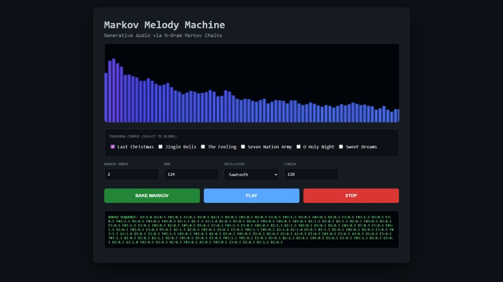
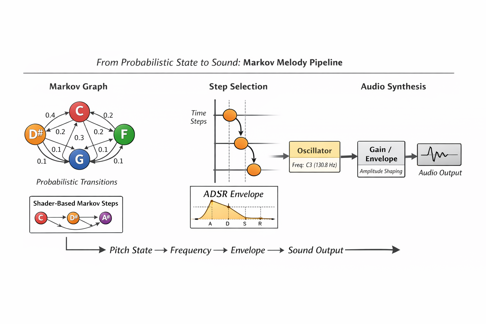

# Markov Melody Machine — Generative Audio via N-Gram Markov Chains

> 💡Note: Throughout this article, I’ve used AI assistance to help refine the text, structure explanations, and craft clear descriptions and comments. All code, ideas, and implementation details are my own — the AI simply helped shape the presentation.

In generative music, the objective is to balance algorithmic autonomy with structural coherence. This article details the implementation of a **Higher-Order Markov Chain** integrated with a **WebAudio API** engine. By utilizing a training corpus of established melodic structures, we can synthesize new sequences that maintain the stylistic intervals of the source material.

## ⚡ The 30-Second Intuition
If you can count occurrences, you can compose music. Imagine we feed the machine the phrase: "C-E-G-C".

The machine learns that after "C", there is a 50% chance of "E" and a 50% chance of... nothing (the end).

By mixing two songs—like a traditional carol and a driving synth bassline—the machine finds "probabilistic hubs." These are shared notes where the algorithm can pivot, seamlessly blending styles into a "statistical fusion."

## The "10-Line" Logic
Before we dive into the high-precision WebAudio engine, here is the core "brain" of a Markov Chain in its simplest form:

```javascript
// 1. The "Brain" (Transition Matrix)
const brain = { 'C4': ['E4', 'G4'], 'E4': ['G4', 'C4'], 'G4': ['C4'] };

// 2. The "Composer" (The Logic)
let currentNote = 'C4';
const generateNext = () => {
  const choices = brain[currentNote];
  // Pick a random "road" from the current note
  currentNote = choices[Math.floor(Math.random() * choices.length)];
  return currentNote;
};

```

The Twist: This logic is surprisingly portable. While we will primarily focus on building a robust system using the WebAudio API, we will conclude by demonstrating how this same "map of roads" can be compressed into a stateless GLSL shader—proving that musical structure can exist as pure, deterministic math.




## 1. The Theory: Modeling Music as a Stochastic Process

At its core, a melody is a discrete-time sequence of events. To generate "new" music that sounds "familiar," we treat composition as a probabilistic journey through a state-space.

### The Mathematics of $n$-order Chains

A Markov Chain is a stochastic model describing a sequence of possible events in which the probability of each event depends only on the state attained in the previous event.¹ For music, we use an $n$-gram model (or $n$-order chain). Given a sequence of musical tokens  
$X_1, X_2, \dots, X_t$, an $n$-order Markov chain satisfies:

$$  
P(X_t | X_{t-1}, X_{t-2}, \dots, X_1) = P(X_t | X_{t-1}, \dots, X_{t-n})  
$$

In our implementation, a **Token** is a string literal containing **{Pitch}:{Duration}**.

-   **Order 1:** The next note depends only on the current note, resulting in high entropy and chaotic melodic jumps.
    
-   **Order 2:** The next note depends on the previous two notes. This preserves local melodic structures and recognizable hooks.
    

> **Higher-Order Trade-Offs:** Increasing the Markov order improves local coherence but introduces a **familiarity–novelty trade-off**. Lower orders produce high-entropy melodies with frequent leaps, while higher orders can start reproducing recognizable fragments from the training corpus. In practice, order 2 or 3 often strikes a balance: sufficient context to maintain melodic logic, yet enough randomness to ensure the sequence feels freshly composed.

When multiple songs are merged—such as the holiday standard **“Jingle Bells”** or the modern syncopation of Lost Frequencies’ **“The Feeling”**—the transition matrix identifies shared tokens. These intersections serve as probabilistic junctions where the algorithm can diverge from one stylistic space into another, producing hybrid melodic output.

> **Note:** _The Feeling_ was chosen as it was the reference song presented in Benni Dibb’s “[Recreating a Hit Song on an 8-Bit Sound Chip](https://github.com/MagnusThor/so-you-think-you-can-code-2025/blob/main/day17/readme.md)”.

### What the Model Learns (and What It Doesn’t)

Although the Markov model operates on symbolic note tokens, it does not understand music in a semantic or harmonic sense. Instead, it captures **statistical regularities** present in the training corpus:

-   **Pitch adjacency** — common melodic steps and leaps
    
-   **Rhythmic continuity** — locally repeating duration patterns
    
-   **Phrase inertia** — tendencies for specific note–duration pairs to recur
    

This behavior emerges directly from how transitions are learned:

```javascript
const state = tokens.slice(i, i + order).join('|');
const next  = tokens[i + order];
matrix.get(state).push(next);
```
Each state is defined purely as a sliding window of tokens, with no awareness of harmonic function, key, or meter.

Equally important are its limitations. The model does **not** explicitly encode:

-   Tonal centers or key signatures    
-   Harmonic resolution (e.g., dominant → tonic)    
-   Long-range musical form

The perceived musicality therefore arises from **corpus bias**, not explicit rules.

> **Corpus Curation Matters:** While the Markov chain captures local statistical tendencies, the **training corpus itself becomes the de facto composer**. Careful curation can influence style coherence: corpora with compatible pitch ranges, rhythmic density, or melodic motifs tend to produce more musically satisfying hybrids. Conversely, merging vastly disparate sources can increase entropy, producing novel but potentially jarring sequences. Practically, normalizing note ranges or aligning rhythmic grids across sources can facilitate smoother statistical fusion.

### Data Representation & Pitch Calculation

To bridge symbolic notation and frequency-based synthesis, we compute equal-temperament frequencies across nine octaves using the standard reference frequency of **440 Hz** ($A_4$).

```javascript
const NOTES = ['C','C#','D','D#','E','F','F#','G','G#','A','A#','B'];
const FREQ = {};
for(let oct = 0; oct < 9; oct++) {
    NOTES.forEach((n, i) => {
        FREQ[`${n}${oct}`] =
            440 * Math.pow(2, ((oct - 4) * 12 + (i - 9)) / 12);
    });
}
```

The song library consists of comma-separated token strings. This makes it trivial to ingest classic riffs such as the minor-key bassline of **“Sweet Dreams”** ($C_3 \rightarrow D\#_3 \rightarrow F_3
$), allowing the generator to pivot across genres — a nod to earlier 8-bit and shader-based music systems explored in this series.

----------

## 2. Technical Architecture: The WebAudio Graph

The system uses a modular WebAudio signal chain. Raw oscillator output is routed through processing nodes to achieve dynamic shaping, spatial depth, and frequency-domain inspection.

### Signal Chain Configuration

1.  **OscillatorNode** — waveform generation    
2.  **GainNode** — ADSR envelope shaping    
3.  **ConvolverNode** — algorithmic reverb
4.  **AnalyserNode** — FFT-based spectral analysis
    

> **Note:** `AnalyserNode` is not required for generation; it is used solely for visualization and inspection in the test application.

### Procedural Impulse Response (IR)

To avoid external assets, the reverb impulse response is synthesized procedurally by filling a buffer with white noise and applying an exponential cubic decay:

$$  
y(t) = \text{noise}(t)\cdot\left(1 - \frac{t}{L}\right)^3  
$$

Here, $L$ is the buffer length and $t$ the sample index. Cubing the decay factor creates a steep early attenuation that more closely resembles real acoustic energy dissipation.

```javascript
createIR() {
    const len = this.ctx.sampleRate * 2.5;
    const buf = this.ctx.createBuffer(2, len, this.ctx.sampleRate);
    for (let c = 0; c < 2; c++) {
        const data = buf.getChannelData(c);
        for (let i = 0; i < len; i++) {
            data[i] =
                (Math.random() * 2 - 1) *
                Math.pow(1 - i / len, 3);
        }
    }
    return buf;
}
```

### Percussive Anchoring and Temporal Stability

Although minimal, the periodic kick drum plays an important psychoacoustic role:

```javascript
if (this.idx % 2 === 0)
    this.playDrum(t, 100, 0.15); // Kick
```

Even sparse percussion:

-   Reinforces tempo perception    
-   Masks micro-timing imperfections    
-   Provides a rhythmic reference grid for stochastic melody

In generative systems, rhythm often acts as a **cognitive anchor**, allowing listeners to tolerate higher melodic entropy without perceiving the output as noise.

## 3. Implementation: Logic and Scheduling

### Melodic Generation Logic

A `Map` structure enables $O(1)$ transition lookups, allowing the generator to navigate the probability space efficiently during real-time synthesis.

```javascript
const buildMarkov = (tokens, order = 2) => {
    const matrix = new Map();
    for (let i = 0; i + order < tokens.length; i++) {
        const state = tokens.slice(i, i + order).join('|');
        const next  = tokens[i + order];
        if (!matrix.has(state)) matrix.set(state, []);
        matrix.get(state).push(next);
    }
    return { matrix, order };
};
```

### Entropy, Bias, and Weighted Sampling

Transition selection typically uses a simple uniform sampler:

```javascript
const choice = arr =>
    arr[Math.floor(Math.random() * arr.length)];
```

To balance novelty and familiarity, the system can **weight transitions according to their frequency** in the corpus. The more often a transition occurs, the higher its probability of being selected. This mechanism is implemented as `getWeightedChoice` in the example app:

```javascript
function getWeightedChoice(options) {
    // options = array of {item, weight} objects
    const totalWeight = options.reduce((sum, o) => sum + o.weight, 0);
    let rnd = Math.random() * totalWeight;
    for (const o of options) {
        if (rnd < o.weight) return o.item;
        rnd -= o.weight;
    }
    return options[options.length-1].item;
}
```

> **Temperature Concept:** Beyond the inherent bias in transition frequencies, a simple extension is to modify the “temperature” of the sampler:
> 
> -   **Low (<1.0):** Frequent transitions dominate → output stays close to the corpus.
>     
> -   **High (>1.0):** Rare transitions are more likely → output becomes adventurous or surprising.  
>     This is illustrated in the example app using the weighted sampler.
>     
----------

### The Look-Ahead Scheduler

To maintain temporal precision, events are scheduled slightly ahead of playback using absolute AudioContext time.

```javascript
this.nextTime = this.ctx.currentTime + 0.05;

while (this.nextTime < this.ctx.currentTime + 0.1) {
    // schedule events ahead of playback
}
```

```javascript
heartbeat(tokens, bpm, wave) {
    if (!this.ctx) return;
    const spb = 60 / bpm;
    while (this.nextTime < this.ctx.currentTime + this.lookahead &&
           this.idx < tokens.length) {

        const [note, dur] = tokens[this.idx].split(':');
        const startTime  = this.nextTime;
        const duration  = parseFloat(dur) * spb;

        const osc  = this.ctx.createOscillator();
        const gain = this.ctx.createGain();

        osc.type = wave;
        osc.frequency.setValueAtTime(FREQ[note], startTime);

        gain.gain.setValueAtTime(0, startTime);
        gain.gain.linearRampToValueAtTime(0.3, startTime + 0.01);
        gain.gain.exponentialRampToValueAtTime(
            0.001, startTime + duration - 0.01
        );

        osc.connect(gain);
        gain.connect(this.master);

        osc.start(startTime);
        osc.stop(startTime + duration);

        this.nextTime += duration;
        this.idx++;
    }
}
```

### Time-Based Scheduling vs. Event-Based Playback

Notes are not triggered “when the loop runs,” but are placed on the **AudioContext timeline** using absolute timestamps. This decouples musical timing from:

-   Frame-rate variability
    
-   Main-thread scheduling
    

By scheduling events slightly ahead of playback, the output remains sample-accurate even under variable UI load or browser activity.

----------

## 4. Theoretical Extension: The Analyser as a “Sensor”

Although commonly used for visualization, the `AnalyserNode` can act as a perceptual sensor:

```javascript
const data = new Uint8Array(this.analyser.frequencyBinCount);
this.analyser.getByteFrequencyData(data);

```

This frequency-domain snapshot provides a real-time summary of spectral energy distribution. In a feedback-driven system, such data could influence synthesis parameters, corpus selection, or transition weighting.

### Conceptual Resynthesis

Analyzer output could drive **additive resynthesis**, reconstructing harmonic profiles from dominant frequency bins. Alternatively, **spectral centroid analysis** could guide the generator toward brighter or darker corpora dynamically.

### Markov Chains as Style Interpolators

Multiple song corpora are flattened into a single token stream:

```javascript
const masterCorpus = selected.join(',').split(',');

```

Shared tokens become probabilistic hubs where stylistic identity can drift. Rather than pastiche, the system produces **statistical fusion**, aligning Markov-based music generation conceptually with procedural shader systems and other data-driven synthesis techniques.

----------

## 5. Conceptual Portability: Markov Chains in a Shader-Based Audio Context

While the implementation presented in this article relies on a stateful JavaScript runtime and the WebAudio API, the underlying probabilistic model is not inherently tied to the CPU, event scheduling, or object graphs.

To illustrate this, a minimal **ShaderToy sound shader** was implemented using GLSL. This version is **not feature-complete**, nor does it attempt to replicate the scheduling, corpus ingestion, or higher-order logic of the WebAudio engine. Instead, it serves as a **conceptual proof** that the same Markov-based melodic logic can operate in a **purely stateless, functional audio environment**.

In a shader context:

-   There is no persistent memory    
-   No mutable state between samples    
-   No event queue or timeline scheduler
    
Instead, musical structure must be reconstructed as a deterministic function of time.

### Stateless Markov Reconstruction

Rather than storing the current Markov state, the shader derives it by replaying the transition process from a fixed origin up to the current time step. While computationally inefficient for large state spaces, this approach demonstrates an important idea: **Markov chains do not require memory—only reproducible probability**.

### Conceptual ShaderToy Implementation




```glsl
// ------------------------------------------------------------
// Markov Melody Machine — ShaderToy Sound Shader
// Conceptual Markov-chain melody 
// ------------------------------------------------------------
#define PI 3.14159265359
const int STATE_COUNT = 5;
float STATES[STATE_COUNT] = float[](0.0, 3.0, 5.0, 7.0, 10.0);
float MARKOV[STATE_COUNT * STATE_COUNT] = float[](
    0.10, 0.40, 0.20, 0.20, 0.10,
    0.20, 0.10, 0.30, 0.30, 0.10,
    0.20, 0.20, 0.10, 0.40, 0.10,
    0.30, 0.20, 0.20, 0.10, 0.20,
    0.40, 0.10, 0.20, 0.20, 0.10
);

float hash(float x) { return fract(sin(x * 127.1) * 43758.5453123); }
int markovNext(int current, float rnd) {
    float acc = 0.0;
    int base = current * STATE_COUNT;
    for (int i = 0; i < STATE_COUNT; ++i) {
        acc += MARKOV[base + i];
        if (rnd <= acc) return i;
    }
    return current;
}
int stateAtStep(int step) {
    int s = 0;
    for (int i = 0; i < step; ++i) s = markovNext(s, hash(float(i)));
    return s;
}
float noteToFreq(float note) { return 440.0 * pow(2.0, (note - 49.0) / 12.0); }
float markovVoice(float time) {
    float stepsPerSecond = 4.0;
    int step = int(floor(time * stepsPerSecond));
    int s = stateAtStep(step);
    float note = 48.0 + STATES[s];
    float freq = noteToFreq(note);
    float localTime = fract(time * stepsPerSecond);
    float env = exp(-6.0 * localTime);
    return sin(2.0 * PI * freq * time) * env;
}
vec2 mainSound(int samp, float time) {
    float sig = markovVoice(time);
    return vec2(sig, sig);
}

```

### Why This Matters

Although simplified, this shader demonstrates that **probabilistic melodic structure is portable across execution models**. The same Markov logic used in a high-level, event-driven WebAudio system can be re-expressed in a data-parallel, stateless shader environment.

----------

## Conclusion: The Ghost in the Machine

The **Markov Melody Machine** demonstrates that musicality is not exclusively a product of human intent, but can emerge from the rigorous application of probability. By marrying the **$n$-order Markov model** with the **WebAudio API’s** high-precision scheduling, we bridge the gap between abstract stochastic theory and tangible acoustic experience.

Key takeaways from this implementation include:

-   **Statistical Identity:** The machine’s stylistic "soul" is a direct reflection of its training data. By blending disparate corpora—the stately intervals of _O Holy Night_ with the dark, rhythmic pulse of _Sweet Dreams_—we witness "statistical fusion," where shared tokens become hubs for stylistic drift.
    
-   **Temporal Integrity:** High-fidelity generative audio requires decoupling logic from the main thread. Utilizing the absolute timeline of the `AudioContext` ensures that the output remains sample-accurate, regardless of UI overhead or browser performance.
    
-   **Algorithmic Portability:** As demonstrated by the GLSL conceptual port, the core logic of a Markov process is agnostic to the execution environment. Whether computed in a stateful JavaScript engine or reconstructed deterministically in a stateless fragment shader, the "rules of the jump" remain constant.
    
-   **Weighted Sampling:** Transition probabilities can bias melodic choice, providing a natural novelty–familiarity balance. The example app illustrates this via `getWeightedChoice`, showing how frequency-based weighting shapes the output.
    

While higher-order Markov chains are not a complete compositional solution, they serve as a powerful foundation. They remind us that within the constraints of mathematics, there is an infinite capacity for novelty.


## 6. Source code & Live example

I placed the source code in the [src folder](src/), and Magnus also helped me publish a live example, which you can find at CodeSandbox: https://qfwmy2.csb.app
## Acknowledgements

This project was developed as part of the **"So You Think You Can Code? — 2025"** Advent Calendar. 🎄

I would like to extend a sincere thank you to the organizers for facilitating this creative space, and to the other contributors whose work over the past 18 days has provided constant inspiration. It is a privilege to contribute to such a diverse collection of technical work. 💻✨

To the readers, the contributors past and present, and the entire coding community:

### **Merry Christmas and Happy Holidays!** 🎅🎁

_Frank Taylor_