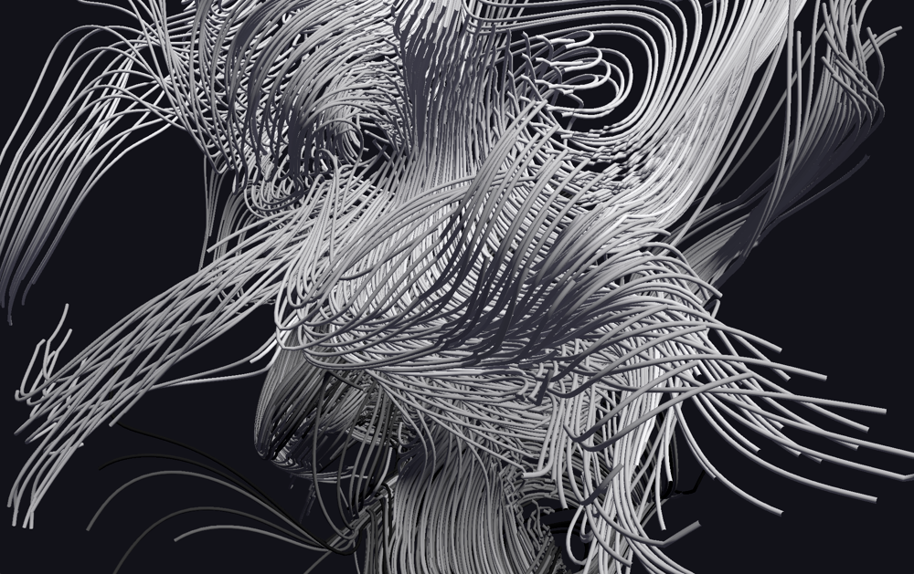

# Day 22: A Nest of Divergence-Free Fields

On creating complex, swirly noodle shapes with compute shaders in Rust and wgpu.

*by [canmom](https://canmom.art). Absolutely no AI was used.*

## What are we trying to do here?

Well the short answer is that we're gonna make [this](https://canmom.art/noodles/) ([source](https://github.com/canmom/noodles)). The long answer follows...

Have a look at this image.


That's pretty cool, isn't it? Almost looks like something Junji Ito might draw. I made that in Blender in a few hours, using Geometry Nodes. And, I'll tell you this, I love Geometry Nodes. But I wanted to animate an effect like this in realtime, on the GPU, so that I could use it in demos and such-like things. In particular, I want these noodles in my game *<cite>Shaderland</cite>*!

So what are we actually looking at? This is an example of integrating **curl noise**. It's a type of **vector field** which, crucially, has **zero divergence** everywhere (up to numerical precision, anyway).

In the process, I'll be going through...

- the concept of divergence-free fields
- creating a simple cross-platform demo using Rust and wgpu
- combining compute shaders with render pipelines

I'm not going to be using any of the more modern styles of graphics programming here (indirect draw, mesh shaders, bindless, etc. etc.); ultimately we're going to be using wgpu in a very traditional way.

All source code from this project is available [here](https://github.com/canmom/noodles).

### A quick overview of the maths

In slightly more detail: A *<dfn>field</dfn>* in this context is essentially a function of space. For any given point in 3D space, you can get a value.

A mathematician would write that as

$$f \colon \mathbb{R}^3 \to S $$

for some output set $S$, but we are programmers, so let's write it in Rust instead.

```rust
trait Field {
  type Output;

  fn evaluate(p: Point) -> Output;
}
```

A [*<dfn>vector field</dfn>*](https://en.wikipedia.org/wiki/Vector_field) is a field whose values are vectors: multi-dimensional objects, with a magnitude and a direction. Some classic examples of vector fields are the wind and the magnetic field. In graphics we might also think of things like surface normals and hair directions.

In mathematical notation, a vector field is a function like this...

$$\mathbf{F} \colon \mathbb{R}^3 \to \mathbb{R}^3$$

(or more generally, to some vector space), while the programmer might think of specialising the trait above...

```rust
Field<Output = Vector>
```

You can do calculus on these! Just like you can calculate the derivative of a scalar-valued function, you can calculate the derivatives of a vector field, essentially by treating each component of the vector field as its own scalar-valued function and doing calculus on that.

Let's go over some notation. I'm going to be using physicist-style notation because guess what, I studied physics. So: if $\mathbf{F}(\mathbf{r})$ is a vector field, it has three components written $F_x(\mathbf{r})$, $F_y(\mathbf{r})$ and $F_z(\mathbf{r})$. $\mathbf{r}$ represents a point in space with components $x$, $y$ and $z$.

Since these are just regular old single-valued functions, we can calculate their derivatives. Generally speaking we'll be calculating partial derivatives such as $$\frac{\partial F_x}{\partial x}$$, which means 'keep $y$ and $z$ constant and take the derivative with respect to $x$'.

Today, we are specifically interested in [divergence-free fields](https://en.wikipedia.org/wiki/Solenoidal_vector_field). What that essentially means is that there are no 'sources' or 'sinks'. It's a field of vortices, much as you might observe in a fluid; you can get closed loops and helices but if you follow along the field, two field lines will never cross each other. But, it's also *noise*, which means it's smoothly varying and random-looking.

In more mathematical terms, the *<dfn>divergence</dfn>* of a vector field $\mathbf{F}(\mathbf{r})$ is the scalar field

$$
\nabla \cdot \mathbf{F} = \frac{\partial F_x}{\partial x} + \frac{\partial F_y}{\partial y} + \frac{\partial F_z}{\partial z}
$$

It has a sibling in the *<dfn>curl</dfn>*, which is a *vector* field calculated like this...

$$
\nabla \times \mathbf{F} = \begin{pmatrix}
  \frac{\partial F_z}{\partial y} - \frac{\partial F_y}{\partial z} \\
  \frac{\partial F_x}{\partial z} - \frac{\partial F_z}{\partial x} \\
  \frac{\partial F_y}{\partial x} - \frac{\partial F_x}{\partial z} \\
\end{pmatrix}
$$

In very rough terms, when you have nonzero divergence, the vector field is either spreading or converging at that point. And when you have nonzero curl, it's twisting around that point. Want to visualise that? [3Blue1Brown](https://www.youtube.com/watch?v=rB83DpBJQsE) has a nice little video on it.

## Begone, divergence!

Luckily, if you have a way to calculate noise (for example, good old Perlin noise), it's actually quite easy to calculate divergence-free noise! The impetus for all of this came from a Wikipedia article called [simulation noise](https://en.wikipedia.org/wiki/Simulation_noise), which provides some convenient tricks.

You need to start with some sort of noise field, and you need to be able to calculate its derivatives. For this we can turn to Inigo Quilez's [GLSL implementation](https://iquilezles.org/articles/gradientnoise/) of gradient noise with an analytic derivative. Big love to Inigo once again.

Once you've got a way to calculate noise, there are two ways to proceed. 'Curl noise' takes a vector-valued noise function (or three scalar-valued noise functions), while 'bitangent noise' takes two scalar-valued noise functions.

A wrinkle here is that we are trying to use the same noise hash function to calculate multiple different fields. What can we do? A simple trick is to add some large offset to the point where we calculate the noise function. This will take us to a different region of the hash function, which should have absolutely nothing to do with any other region. So, if you have a favourite hash function (mine is `pcg3d`), you can use that for as many noise fields as you require.

Recently in the FieldFX shader jams I've been creating particle sims which use this kind of noise to move particles around, and that can create some beautiful plasma shapes. However, we don't just want particles. We want *noodles*.

### Finding a field line

The trick we use to calculate these noodles is to integrate the field, finding a [*field line*](https://en.wikipedia.org/wiki/Field_line). (In fluid dynamics, this is called a [*streamline*](https://en.wikipedia.org/wiki/Streamlines,_streaklines,_and_pathlines), and in general this is an [integral curve](https://en.wikipedia.org/wiki/Integral_curve)).

Let's say we start at a point $\mathbf{p}_0$. We evaluate the field at $\mathbf{p}_0$, getting a vector $\mathbf{F}(\mathbf{p}_0)$; then walk a small distance in that direction to a new point $\mathbf{p}_1$. Repeat as many times as we want, and we get a series of points along the streamline (up to numerical error, anyway).

In mathematical terms, this is using [Euler's method](https://en.wikipedia.org/wiki/Euler_method) to calculate an approximate solution to this differential equation:

$$
\frac{d\mathbf{r}}{dt}=\mathbf{F}(\mathbf{r}(t))
$$

with the initial condition $\mathbf{r}(0) = \mathbf{p}_0$. If you want a more accurate result, you can use a different integration scheme like implicit Euler or RK4, but regular explicit Euler has the advantage of being dead simple and fast, and really, the only thing we care about is 'does it look pretty'. Better integration is an exercise to the reader ;P

## Drawing a field line

OK, what do we do once we have those points? Well, there are various possibilities, but since we're using the GPU, my inclination is to do an **instanced draw** where an instance is one cylindrical segment stretching between two successive points of the noodle.

### Drawing in wgpu

Today I'll be using [wgpu](https://docs.rs/wgpu/latest/wgpu/), a Rust library which gives a WebGPU-like abstraction over APIs such as Vulkan, Metal and DirectX12. Although it was invented for Firefox's implementation of webgpu, it has become pretty much the backbone of the Rust game ecosystem.

In order to draw our noodles, we need to carry out the following operations:

- create the 'noodle segment' instance model and upload it to the GPU
- create a compute shader pipeline to calculate where all the instances should be
- create a graphics pipeline to render the noodle segments
- queue up the compute pipeline and then the graphics pipeline on every frame

But before we do any of that, we've got some homework to do.

### Let's get started, shall we?

For the sake of this project, I'll demonstrate it in a standalone application. But it should be easy enough to extract the relevant bits to an existing Rust program using wpgu.

This is not a sizecoding project! The binary will probably be several megabytes just from the library code alone. But we don't want to be extravagant, not to mention we would like our code to be faster, so let's turn on stripping and link-time optimisation:

```toml
[profile.release]
lto = "thin"

[target.'cfg(not(target_arch = "wasm32"))'.profile.release]
strip = "symbols"
```
At time of writing, having `strip` enabled breaks `wasm-opt` for mysterious reasons related to bulk memory operations, so we have to disable it for web builds.

By default, Rust will give us a 'hello world' program. Let's run `cargo build --release` and make sure nothing untoward has happened. On Windows, this will result in a `noodles.exe` program weighing about 133KB.

(Yeah, that's pretty huge for a hello world, but Rust is not optimised for sizecoding out of the box! It will by default generate a lot of panic-handling code to unwind the stack and print the results to the console, and statically link the pre-built standard library. We can run `cargo bloat` and find that nearly all of those kilobytes are from backtrace code and string handling. This can be removed easily enough, see [min-sized Rust](https://github.com/johnthagen/min-sized-rust) to find out how, but for our purposes this is fine and having backtraces will be useful when something goes wrong.)

### Getting a window on the screen

So, we need a window to see anything. I will broadly follow along with [Learn WGPU](https://sotrh.github.io/learn-wgpu/beginner/tutorial1-window/) to create a window with winit and set up wgpu state. The code for setting everything up is mostly not of interest for this article, so I will mostly brush over it.

At the time of writing, the versions of `wgpu` and `winit` I am using are...

```toml
[dependencies]
wgpu = "27.0.1"
winit = "0.30.12"
```

But if you're reading this article in the future, a different version may be current! The API of `wgpu` changes sometimes, mainly to add features. If you're using an IDE, it should warn you if you're missing a struct field or similar problems.

Following the first two parts of the guide, we will set up a basic `wgpu` and `winit` application, creating a resizable window on native targets and a WASM+WebGPU application on web targets. I've added the option to switch between fullscreen and windowed with the F11 key. Then, we'll set up a basic render pass which clears the screen.

We need some types to store vectors and matrices. I will be using [`glam`](https://docs.rs/glam/0.30.9/glam/index.html), since it offers some convenient features. It is potentially possible to use other crates, like cgmath. I'll also be using [`bytemuck`](https://docs.rs/bytemuck/1.24.0/bytemuck/index.html) for casting to bytes to send to the GPU.

```toml
bytemuck = "1.24.0"
glam = {version = "0.30.9", features = ["bytemuck"]}
```

We'll diverge from the tutorial on page 3, where we start creating pipelines. If you have an existing wgpu application (including projects using other Rust libraries which use wgpu, such as Bevy or Iced), this should be able to be dropped into your existing rendering logic.

With all the logging features and such, a basic 'clears the screen' wgpu application weighs around 8MB on native. I won't keep track of this further, just noting this to give a sense of what a default Rust application looks like to the sizecoding-curious.

## Let's make some pipelines

So, we need to do two things here: a compute pipeline and a standard rendering pipeline. We'll start with the latter, since we'll have a hard time knowing if the compute pipeline is doing its job if we can't render the results.

First, we need to figure out what data we'll be sending to the GPU. To begin with, our model segment will be made up of vertices. For a geometer, a vertex is a point in space. For a graphics programmer, a vertex is a struct. So normally you might have, say, normals and colours and so on. However, today, it actually *is* just a position.

```rust
use glam::Vec3;

#[repr(C)]
#[derive(Debug, Copy, Clone, bytemuck::Zeroable, bytemuck::Pod)]
pub struct Vertex {
    pub position: Vec3,
}
```
Why no normals? For the specific model we're using, we don't actually need them, they can be calculated from the position in the vertex shader. And if we add colours, it will be per-instance, not per-vertex. There's no real need to create a wrapping type like this, this `Vertex` is byte for byte identical to `Vec3`, but I am doing it because most of the time you *do* have multiple things here and consistency is nice.

We'll also need to tell wgpu how this struct is laid out, which involves creating an array of vertex attribute descriptors. There is a helper macro [`vertex_attr_array`](https://docs.rs/wgpu/latest/wgpu/macro.vertex_attr_array.html) to help here. I didn't know about that macro for months, so I was adding up all the offsets by hand. Don't be me...

```rust
impl Vertex {
    pub const LAYOUT: wgpu::VertexBufferLayout<'static> = wgpu::VertexBufferLayout {
        array_stride: std::mem::size_of::<Self>() as wgpu::BufferAddress,
        step_mode: wgpu::VertexStepMode::Vertex,
        attributes: &wgpu::vertex_attr_array![
            0 => Float32x3,
        ],
    };
}
```

A pipeline segment needs both a start point and an endpoint. At each point, we need the [normal and bitangent](https://en.wikipedia.org/wiki/Frenet%E2%80%93Serret_formulas): the basis vectors of a 2D space perpendicular to the line we're following.

I think we could in principle overlap the data of successive segments since the endpoint of one segment is the start point of the next, which would save about half the data. But that might lead to problems to do with the array stride, and handling endpoints would get a fiddly, so for simplicity's sake, we'll treat each segment as its own, non-overlapping struct.

We define an instance like so:

```rust
#[repr(C)]
#[derive(Copy, Clone, Debug, bytemuck::Zeroable, bytemuck::Pod)]
pub struct TubeInstance {
    pub start_position: Vec3,
    pub start_normal: Vec3,
    pub start_bitangent: Vec3,
    pub end_position: Vec3,
    pub end_normal: Vec3,
    pub end_bitangent: Vec3,
    pub colour: Vec3,
    pub radius: f32,
}
```

This adds up to a total of 19 floats, or 76 bytes, per instance. We need to provide a `VertexBufferLayout` to wgpu to describe this struct. 

```rust
impl TubeInstance {
    pub const LAYOUT: wgpu::VertexBufferLayout<'static> = wgpu::VertexBufferLayout {
        array_stride: std::mem::size_of::<Self>() as wgpu::BufferAddress,
        step_mode: wgpu::VertexStepMode::Instance,
        attributes: &wgpu::vertex_attr_array![
            1 => Float32x3,
            2 => Float32x3,
            3 => Float32x3,
            4 => Float32x3,
            5 => Float32x3,
            6 => Float32x3,
            7 => Float32x3,
            8 => Float32,
        ],
    };
}
```
These numbers will be used in our shader to read out the attributes, so it's important they don't overlap for the instance and vertex.

### Filling out the forms

Since it's abstracting modern, low-level APIs like DirectX 12 and Vulkan, to draw something in wgpu amounts to a lot of 'filling out forms'. In some ways, it's quite easy. The type system tells you more or less what you need at each stage, so it's your job to construct the desired types.

With wgpu, you can usually work backwards. Ultimately, to render stuff we're going to need a [`RenderPipeline`](https://docs.rs/wgpu/latest/wgpu/struct.RenderPipeline.html). How do we create a render pipeline? The documentation helpfully tells us: we need to call [`create_render_pipeline`](https://docs.rs/wgpu/latest/wgpu/struct.Device.html#method.create_render_pipeline) on a `Device`, and that takes a `RenderPipelineDescriptor`.

Well, then we can ask what goes into a `RenderPipelineDescriptor`? Follow the documentation, and we find it takes this stuff:

```rust
pub struct RenderPipelineDescriptor<'a> {
    pub label: Label<'a>,
    pub layout: Option<&'a PipelineLayout>,
    pub vertex: VertexState<'a>,
    pub primitive: PrimitiveState,
    pub depth_stencil: Option<DepthStencilState>,
    pub multisample: MultisampleState,
    pub fragment: Option<FragmentState<'a>>,
    pub multiview: Option<NonZeroU32>,
    pub cache: Option<&'a PipelineCache>,
}
```
Most of these are structs defined by wgpu, and for each one, we can look up how to create it, typically by calling a function on `Device`. (It's a lot easier with an IDE which supports Rust-Analyzer, which can autofill the skeleton of the type for you.)

What are the important fields for this article? Well, we definitely need a vertex and fragment shader, so let's start with that.

## The vertex shader

We will need to start by telling the vertex shader what to expect, and what to output. This largely follows the attributes we defined above, just wgsl flavoured instead of Rust-flavoured.

```wgsl
struct VertexInput {
    @location(0) position: vec3<f32>,
}

struct Instance {
    @location(1) start_position: vec3<f32>,
    @location(2) start_normal: vec3<f32>,
    @location(3) start_bitangent: vec3<f32>,
    @location(4) end_position: vec3<f32>,
    @location(5) end_normal: vec3<f32>,
    @location(6) end_bitangent: vec3<f32>,
    @location(7) colour: vec3<f32>,
    @location(8) radius: f32,
}

struct VertexOutput {
    @builtin(position) clip_position : vec4<f32>,
    @location(0) normal: vec3<f32>,
    @location(1) colour: vec3<f32>,
}
```

We'll also need the camera view-projection matrix. This can be passed in as a uniform, I'll get into that subject later. For now, from the shader point of view, it's declared like this:

```wgsl
struct Uniforms {
    camera: mat4x4<f32>,
}

@group(0) @binding(0) var<uniform> uniforms: Uniforms;
```
I'll be adding more stuff to the uniforms later!

To draw a segment we need to figure out where the vertices must end up, then project them into perspective. Let's start with the first part.

Each invocation of the vertex shader gets a copy of the instance data, and the data for one specific vertex of the original model. So, we need to know a little about the structure of the model we're going to be rendering. Essentially, it will be a cylinder of radius 1, pointed in the `z` direction. So you have some number of vertices in a circle in the xy plane, and some other number of vertices in a circle in the z=1.0 plane.

As such, we can select whether to use the start or endpoint based on the value of `z`. So, the first three lines of our shader select which part of the instance data to use.

```wgsl
@vertex
fn vs_main(vert: VertexInput, instance: Instance) -> VertexOutput {
    let curve_position = mix(instance.start_position, instance.end_position, vert.position.z);
    let curve_normal = mix(instance.start_normal, instance.end_normal, vert.position.z);
    let curve_bitangent = mix(instance.start_bitangent, instance.end_bitangent, vert.position.z);
    //continued...
```
Would it be faster to do a branch instead of a multiply? Not sure. Perhaps we can benchmark it later. I doubt it will make a huge difference, but perhaps if we can find a way to let the compiler know that `vert.position.z` will only take two values, it can make some optimisation.

The curve's normal and bitangent vectors are essentially the 'new' `x` and `y` for our cylinder. So we can project into 'cylinder space' simply by multiplying the unit vectors by the coordinates.

```wgsl
    //...
    let world_normal = vert.position.x * spline_normal + vert.position.y * spline_bitangent;
    let world_position = spline_position + world_normal * instance.radius;
    //...
```
Now we need to project it into camera space. This is just a matrix-vector multiplication:

```wgsl
    //...
    let clip_position = uniforms.camera * vec4(world_position, 1.0);
    return VertexOutput(clip_position, world_normal, vert.colour);
}
```
Of course, we do need to actually *calculate* the camera matrix.

### Back to Rust...

Back on the CPU, we now need to pass the shader we just wrote to the pipeline. This means we need a module. A module can be compiled directly from the WGSL source, but if you are dealing with user-written shaders, it's good to validate it by compiling it with Naga and handling errors before you pass the resulting module to wgpu, or your program will panic. (If you find yourself writing a game about shader programming, this may be important...)

We can use Rust's `include_str!` macro to include the shader directly inside our executable as a static string reference.

```rust
let shaders = device.create_shader_module(wgpu::ShaderModuleDescriptor {
    label: Some("Noodles vertex shader"),
    source: wgpu::ShaderSource::Wgsl(include_str!("shaders/tube.wgsl").into()),
});
```

Then we can pass a reference to this module in the render pipeline descriptor.

```rust
wgpu::RenderPipelineDescriptor {
    //...
    vertex: wgpu::VertexState {
        module: &shaders,
        entry_point: Some("vs_main"),
        compilation_options: Default::default(),
        buffers: &[Vertex::LAYOUT, TubeInstance::LAYOUT],
    },
    //...
}
```

## Fragment shader

We can do pretty much any sort of surface we can imagine with the fragment shader, but to begin with, I'm going to go for bog-standard Lambertian diffuse lighting. First, let's put a light direction into the uniforms, so change the declaration to...

```wgsl
struct Uniforms {
    camera: mat4x4<f32>,
    light_direction: vec3<f32>,
    ambient: vec3<f32>
}
```
Then, we can do this:

```wgsl
@fragment
fn fs_main(in: VertexOutput) -> @location(0) vec4<f32> {
    return vec4(in.colour * saturate(dot(uniforms.light_direction, in.normal))
        + in.colour * uniforms.ambient, 1.0);
}
```
This should be enough to verify whether the shader is working. We can make it prettier later.

### Once again, to Rust...

We can include the fragment shader very simply. Only real difference is that we need to include the colour target state instead of the input buffer layouts.

```rust
wgpu::RenderPipelineDescriptor {
    //...
    fragment: Some(wgpu::VertexState {
        module: &shaders,
        entry_point: Some("fs_main"),
        compilation_options: Default::default(),
        targets: &[Some(wgpu::ColorTargetState {
            format: surface_format,
            blend: Some(wgpu::BlendState::REPLACE),
            write_mask: wgpu::ColorWrites::ALL,
        })],
    }),
    //...
}
```
Our noodles will be completely opaque, so we don't have to do anything fancy here. Where do we get `surface_format`? We have to pass that in from outside when constructing the render pipeline.

We'll also need to handle the depth buffer. For this, you must create a texture and view the same size as the screen buffer. We can largely follow [Learn WGPU](https://sotrh.github.io/learn-wgpu/beginner/tutorial8-depth/) here, but this is important to note if you're using a framework (such as Iced) which gives you a framebuffer but not a depth buffer.

For the depth buffer, we can use the [clever trick](https://www.reedbeta.com/blog/depth-precision-visualized/) of reversing the depth values to better distribute floating point precision. Right now that simply means using `Greater` rather than `Less` as our comparison function.

```rust
wgpu::RenderPipelineDescriptor {
    //...
    depth_stencil: Some(wgpu::DepthStencilState {
        format: wgpu::TextureFormat::Depth32Float,
        depth_write_enabled: true,
        depth_compare: wgpu::CompareFunction::Greater,
        stencil: Default::default(),
        bias: Default::default(),
    }),
    //...
}
```
That leaves the uniforms.

## Putting on the uniform

Let's first make a struct on the Rust side to store our uniforms. Naively, we would want to do this...

```rust
//does not compile!
#[repr(C)]
#[derive(Debug, Copy, Clone, bytemuck::Zeroable, bytemuck::Pod)]
struct Uniforms {
    camera: Mat4,
    light_direction: Vec3,
    ambient: Vec3,
}
```
But if you do this, you'll find a confusing problem: `Vec3` is aligned to 4 bytes, while `Mat4` is aligned to 16 bytes. If you don't pad this to fill up a 16 byte alignment, you can't mark it as `bytemuck::Pod` because Rust will quietly add hidden padding bytes which may be uninitialised... and that's a big no-no for casting ([it's categorically undefined behaviour](https://www.ralfj.de/blog/2019/07/14/uninit.html)).

Even more confusingly, if you just add, say, a couple of floats at the end of the struct, there will be a misalignment between Rust's representation and wgsl's, since wgsl's vec3 type is 16-byte aligned. So we have to instead put the padding at the end of each vector...

```rust
#[repr(C)]
#[derive(Debug, Copy, Clone, bytemuck::Zeroable, bytemuck::Pod)]
struct Uniforms {
    camera: Mat4,
    light_direction: Vec3,
    _padding_1: u32,
    ambient: Vec3,
    _padding_2: u32,
}
```
There may be a way to avoid this kind of manual padding but I'm not sure what it is. (Of course, if we can think of a use of two floats worth of uniforms, we can 'fill in the gaps'.)

Now we need to create the pipeline layout, and also the uniform buffer itself. First the buffer:

```rust
let uniform_buffer = device.create_buffer(&wgpu::BufferDescriptor {
    label: Some("Noodle uniform buffer"),
    size: (std::mem::size_of::<Uniforms>() as u64).div_ceil(16) * 16,
    usage: wgpu::BufferUsages::UNIFORM | wgpu::BufferUsages::COPY_DST,
    mapped_at_creation: false,
});
```
wgpu requires a 16-byte aligned size, and will get upset if it doesn't get it. In this case we are actually guaranteed that, but I always round the size to a multiple of 16 just in case. The `usage` field tells wgpu that we want to read it as a uniform and write to it from the CPU.

The pipeline layout field is mostly used to pass in a bind group layout, which tells the pipeline about the kinds of resources (such as uniform buffers, storage buffers, texture samplers and so forth) it can provide to the shaders. You can have multiple different bind groups with the same layout, and plug them into the same render pipeline.

However, it is actually possible to derive the bind group layout automatically from the shaders by passing `None` instead of a layout when creating the render pipeline. Even with this shortcut, we'll need to create a bind group that matches the layout. Although we haven't finished creating the render pipeline yet, the way to do this will be like so...

```rust
let bind_group_layout = render_pipeline.get_bind_group_layout(0);

let bind_group = device.create_bind_group(&wgpu::BindGroupDescriptor {
    label: Some("Noodle bind group"),
    layout: &bind_group_layout,
    entries: &[wgpu::BindGroupEntry {
        binding: 0,
        resource: uniform_buffer.as_entire_binding(),
    }],
});
```
The rest of the stuff going into the render pipeline is all pretty standard, we're mostly disabling stuff like multisampling for this render pipeline. (Later we might want to add MSAA, but for now, keeping it chunky.)

### Calculating the camera matrix

We're drawing in perspective, we need a perspective projection matrix. If you're not familiar, I recommend taking a look through [Scratchapixel](https://scratchapixel.com/lessons/3d-basic-rendering/perspective-and-orthographic-projection-matrix/).

Since the vertex shader already handles the transformation from model space into world space for our spline segments, what we are calculating here is just the View-Projection matrix. We need to rotate everything into the space of our camera, project it to normalised device coordinates, and set up the z-divide.

We could work through the maths of constructing a perspective projection matrix for our problem right here, or we can just [use `glam` to do it](https://docs.rs/glam/latest/glam/f32/struct.Mat4.html#method.perspective_infinite_reverse_rh).

For the view matrix, for now we can just take a position and a target and use [`look_at`](https://docs.rs/glam/0.30.9/glam/f32/struct.Mat4.html#method.look_at_rh). (If you want to do this manually, you can calculate the basis vectors with cross products and normalisation.)

Then we can multiply these two matrices together, applying view before perspective.

```rust
pub fn update_uniforms(
    &self,
    queue: &wgpu::Queue,
    camera_pos: Vec3,
    camera_target: Vec3,
    aspect_ratio: f32,
) {
    let projection = Mat4::perspective_infinite_reverse_rh(PI / 6.0, aspect_ratio, 0.5);
    let view = Mat4::look_at_rh(camera_pos, camera_target, vec3(0.0, 0.0, 1.0));
    let new_uniforms = Uniforms {
        camera: projection * view,
        light_direction: vec3(-0.5, -0.2, 1.0).normalize(),
        _padding_1: 0,
        ambient: vec3(0.05, 0.05, 0.07),
        _padding_2: 0,
    };
    queue.write_buffer(&self.uniform_buffer, 0, bytes_of(&new_uniforms));
}
```
I've just picked some arbitrary values for lights for now. I'm using a right-handed z-up coordinate system similar to Blender, but ultimately if you want to use a different coordinate system orientation, it's as simple as switching the 'up' vector and if necessary using `_lh` variants of the `Mat4` constructor.

## Creating the model

We're almost at the point where we can render some tubes. We have the render pipeline, now we just need some buffers to render.

To render a model, we generally need vertices and triangle indices. Since our model is so simple, we can generate these programmatically on the CPU.

We're dealing with angles, so this is a great time to grab $\pi$ and $\tau$ from the standard library.

```rust
use std::f32::consts::{PI, TAU};
```

The vertices are simpler, so let's start here. We could mess around with iterator chains, but it's nicer to be able to create a fixed-size array and skip a heap allocation. So I write the vertices in pairs at alternating ends of the cylinder. Using `std::array::from_fn` lets us assign and initialise the array at the same time, similar to how in C you might allocate an uninitialised array and then write to it. (You can do that in Rust using `MaybeUninit` but you should almost never have to.)

To feed it into the buffer at the same time we create it, we can include the extension trait `wgpu::util::DeviceExt` which adds a helpful method called `create_buffer_init`. This saves us having to calculate the size of the buffer.

```rust
const SIDES: usize = 8;
const VERTICES: usize = 2 * Self::SIDES;

fn create_cylinder(device: &wgpu::Device) -> wgpu::Buffer {
    let vertices: [Vertex; Self::VERTICES] = std::array::from_fn(|i| {
        let side = i / 2;
        let end = i % 2;
        let angle = TAU * (side as f32) / (Self::SIDES as f32);
        Vertex {
            position: Vec3 {
                x: angle.cos(),
                y: angle.sin(),
                z: end as f32,
            },
        }
    });
    device.create_buffer_init(&wgpu::util::BufferInitDescriptor {
        label: Some("Noodle vertex buffer"),
        contents: bytemuck::cast_slice(&vertices),
        usage: wgpu::BufferUsages::VERTEX,
    })
}
```
This way of ordering the vertices actually means our vertices are effectively already laid out as a triangle strip. So we can skip writing an index buffer altogether. Just make sure to set `topology: wgpu::PrimitiveTopology::TriangleStrip` in the `primitive` field on the render pipeline.

## Creating an instance buffer

Ultimately, the plan is to populate the instance buffer with a compute shader, but for now, we can write an example buffer on the CPU. I want some shapes with curves so that we can make sure the system is working before we start on the compute shaders. So, let's just draw some sinusoids. I'll start with a relatively modest 4096 segments. We'll draw four separate sinusoids at 1024 segments each, spaced evenly along the $x$ axis.

Given a curve parameter $t$, the position of each vertex in strand $s$ is $\mathbf{r}_s(t)=(s, t, \sin t)$. What about the normal and bitangent? We could calculate this 'properly' with the Frenet-Serret formulae, but if you rotate things in your head for a second you may see that, for a sine wave wiggling along the $y$ axis, the bitangent is always going to be $\mathbf{B}(t)=(-1, 0, 0)$. The normal vector is slightly more tricky. It's easier to start with the tangent vector, which is defined by

$$
\mathbf{T}(t) = \frac{\mathbf{r}'(t)}{\lvert \mathbf{r}'(t)\rvert}
$$

so in our case,

$$
\mathbf{T}(t)=\frac{1}{\sqrt{1+\cos^2 t}}\begin{pmatrix}0 \\ 1 \\ \cos t\end{pmatrix}
$$

So the normal vector must be...

$$
\mathbf{N}=\mathbf{T}\times\mathbf{B}=\frac{1}{\sqrt{1+\cos^2 t}}\begin{pmatrix}0 \\ -\cos t \\ 1\end{pmatrix}
$$

But we can skip the normalisation factor and just call `normalize()`.

```rust
const SEGMENTS: usize = 4096;

fn create_sinusoid_instances(device: &wgpu::Device) -> wgpu::Buffer {
    const SEGMENTS_PER_STRAND: usize = 1024;
    let spacing = TAU / (SEGMENTS_PER_STRAND as f32);
    let instances: [TubeInstance; Self::SEGMENTS] = std::array::from_fn(|i| {
        let strand = i / SEGMENTS_PER_STRAND;
        let i = i % SEGMENTS_PER_STRAND;
        let t = spacing * (i as f32);
        let t_next = spacing * ((i + 1) as f32);

        TubeInstance {
            start_position: vec3(strand as f32, t, t.sin()),
            end_position: vec3(strand as f32, t_next, t_next.sin()),
            start_bitangent: vec3(-1.0, 0.0, 0.0),
            end_bitangent: vec3(-1.0, 0.0, 0.0),
            start_normal: vec3(0.0, -t.cos(), 1.0).normalize(),
            end_normal: vec3(0.0, -t_next.cos(), 1.0).normalize(),
            colour: vec3(1.0,1.0,1.0),
            radius: 0.05,
        }
    });
    device.create_buffer_init(&wgpu::util::BufferInitDescriptor {
        label: Some("Noodle instance buffer"),
        contents: bytemuck::cast_slice(&instances),
        usage: wgpu::BufferUsages::VERTEX,
    })
}
```
We can call this function and keep the buffer around to pass slices in during rendering.

You might wonder why we have `BufferUsages::Vertex` here, when this is a buffer for instances. The answer is that instance buffers are considered a type of vertex buffer. Earlier on, when we declared our vertex buffer layouts, we specified whether they use `step_mode` of `Instance` or `Vertex`. That's the only difference. (However, later this is going to prove problematic...)

All of this can now be bundled up in a struct which holds handles to all the GPU stuff we might need to use for rendering.

```rust
pub struct Pipelines {
    render_pipeline: wgpu::RenderPipeline,
    bind_group: wgpu::BindGroup,
    uniform_buffer: wgpu::Buffer,
    cylinder_vertex_buffer: wgpu::Buffer,
    instance_buffer: wgpu::Buffer,
}
```

## Rendering

We've done a lot of work to draw some simple wiggles, but let's go ahead and actually see it now. To render something in wgpu, you create a render pass, which records a series of commands to execute in series and render some stuff. It's pretty simple, really. Here's the render function:

```rust
pub fn render(&self, render_pass: &mut wgpu::RenderPass) {
    render_pass.set_pipeline(&self.render_pipeline);
    render_pass.set_bind_group(0, &self.bind_group, &[]);
    render_pass.set_vertex_buffer(0, self.cylinder_vertex_buffer.slice(..));
    render_pass.set_vertex_buffer(1, self.instance_buffer.slice(..));
    render_pass.draw(0..(Self::VERTICES as u32), 0..(Self::SEGMENTS as u32))
}
```
So, in theory, with all that code we can now pass a camera matrix to the uniform buffer and start rendering some wiggles! Here's the outer rendering code, nothing fancy.

```rust
let centre = vec3(1.5, std::f32::consts::PI, 0.0);

self.pipelines.update_uniforms(
    &self.queue,
    centre + vec3(5.0 * elapsed_time.cos(), 5.0 * elapsed_time.sin(), 1.0),
    centre,
    self.surface_config.width as f32 / self.surface_config.height as f32,
);

{
    let mut render_pass = encoder.begin_render_pass(&wgpu::RenderPassDescriptor {
        label: Some("Render Pass"),
        color_attachments: &[Some(wgpu::RenderPassColorAttachment {
            view: &view,
            resolve_target: None,
            ops: wgpu::Operations {
                load: wgpu::LoadOp::Clear(wgpu::Color {
                    r: 0.01,
                    g: 0.01,
                    b: 0.014,
                    a: 1.0,
                }),
                store: wgpu::StoreOp::Store,
            },
            depth_slice: None,
        })],
        depth_stencil_attachment: Some(wgpu::RenderPassDepthStencilAttachment {
            view: &depth_view,
            depth_ops: Some(wgpu::Operations {
                load: wgpu::LoadOp::Clear(0.0),
                store: wgpu::StoreOp::Store,
            }),
            stencil_ops: None,
        }),
        occlusion_query_set: None,
        timestamp_writes: None,
    });

    self.pipelines.render(&mut render_pass);
}
```
Note that because we're using reverse depth, we must clear the depth buffer to zero, not one. Why is the render pass in a block? Well, wgpu automatically writes it to the command buffer *when it's dropped*.


If you've been following along this far, run the program now and you will see four nice smooth sinusoids spinning steadily around the centre of the world!

### Getting this to work on web

Back on [Day 9](https://github.com/MagnusThor/so-you-think-you-can-code-2025/tree/main/day09), Magnus showed how to create a simple WebGPU fullscreen shader running in the browser. As far as I can tell, my implementation of this app is pretty similar. Instead of using `js-sys` I'm using `web-time` to provide a common abstraction between native and web. For some reason, Magnus's demo runs a whole lot better on Firefox than mine. I haven't worked out why yet. If anyone reading this has some insight, I'd be very grateful!

It took a lot of time to find all the small mistakes I'd made, but ultimately it mostly amounted to 'missing something on Learn WGPU'.

There is one wrinkle that needs to be taken care of. On native, we can declare the surface uses an sRGB texture format. On web, the WebGPU spec says that the `GPUCanvasConfiguration` [cannot use sRGB formats](https://www.w3.org/TR/webgpu/#canvas-configuration) such as `Bgra8UnormSrgb`. I'm not sure exactly how that maps to wgpu, but in practice for this or some other reason, when we look for a surface format on web we will only find non-sRGB ones. As a result, our renders will look weirdly dark, because we have not applied the proper [transfer function](https://en.wikipedia.org/wiki/SRGB#Transfer_function_(%22gamma%22)).

```rust
let surface_format = surface_capabilities
    .formats
    .iter()
    .find(|f| f.is_srgb())
    .copied()
    .unwrap_or(surface_capabilities.formats[0]);
```
However, on web we can still have an sRGB *view* of a non-sRGB *texture*. To support this, we need to do a few things. First, we need to make sure we've declared that our surface texture supports sRGB views when we create it...

```rust
let surface_config = wgpu::SurfaceConfiguration {
    //...
    format: surface_format,
    view_formats: vec![surface_format.add_srgb_suffix()],
    //...
};
```
Then, when we create a texture view to render into, we must create a view with this alternative sRGB view format...

```rust
let output = self.surface.get_current_texture()?;

let view = output.texture.create_view(&wgpu::TextureViewDescriptor {
    format: Some(self.surface_config.format.add_srgb_suffix()),
    ..Default::default()
});
```
On native, `add_srgb_suffix` is a noop. With these changes, both on web and on native you'll get the proper linear->sRGB transfer when writing to the texture.

Right now we're directly rendering onto the surface, but if we wanted to do HDR rendering, post-processing etc. we would probably want to stay in linear float space until the end.

## Boiling our noodles with compute shaders

Having successfully created a renderer for long noodly things, we can get onto the actual main part of this story: rendering divergence-free fields. Phew.

To do this, we're going to need to create a compute pipeline. The process for doing this is actually a bit simpler than creating a render pipeline, but there are some wrinkles to take care of.

Just as we did with the render pipeline, we'll start at the end. We need to fill out this form...

```rust
let compute_pipeline = device.create_compute_pipeline(&wgpu::ComputePipelineDescriptor {
    label: (),
    layout: (),
    module: (),
    entry_point: (),
    compilation_options: (),
    cache: (),
});
```
The module is where our shader goes. The rest is boilerplate stuff.

### What is a compute shader?

If you've read this far you're likely familiar enough with the usual shaders, but perhaps you're like me and find compute shaders a little mysterious. A vertex shader's most important job is to take vertex data and put it into clip space and it will be invoked once for each vertex. A fragment shader's main job is to tell pixels what colour to be, and it will be invoked once per pixel covered by a triangle (or more with MSAA). Of course, you can do other stuff with them too, but that is a pretty clear place to start.

But a compute shader can do pretty much anything, which might you feeling a bit lost. And if you look into it, well, what's all this 3D grid stuff about? How do you decide how many things go in your grid?

Essentially, the compute shaders are fired off in little groups of up to around 256 invocations (or more, depending on your device, but 256 is guaranteed by wgpu). The workgroups are indexed on a 3D grid, and within each workgroup, the invocations are also indexed on a 3D grid. You are basically free to arrange that how you want, e.g. if you just want a linear array index you can put them all in a long line, but if you're working on 2D or 3D data you can cut them up some other way.

OK, but what happens then? Where does the return value of the compute shader *go*? Well, they can essentially read and write arbitrarily to 'Storage' buffers, which you feed in using a bind group.

But hold on, you might say, doesn't that mean huge race conditions if two, ten or a thousand invocations of the shader write to the same place? Yep, it absolutely means that! To deal with that, if your shaders might read and write to the same place, you can use [atomic types](https://www.w3.org/TR/WGSL/#atomic-types) and [atomic functions](https://www.w3.org/TR/WGSL/#atomic-builtin-functions). For example, you could use `atomicMin` to find the minimum of all the atomic operations, or `atomicAdd` to add up a bunch of stuff.

You can also use barriers to synchronise groups of threads. `workgroupBarrier` and `storageBarrier` can keep threads waiting until the other threads catch up, which can be useful for certain types of algorithm like [sorting](https://sotrh.github.io/learn-wgpu/compute/sorting/#race-conditions-and-barriers).

So, in short: if vertex and fragment shaders are most of the time pure functions (notwithstanding that fragment shaders can *also* write to buffers with atomics), compute shaders give you the full chaos of parallel programming but also the tools to handle it.

I'm only beginning to get to grips with what compute shaders can do, so I hope you can forgive this long explanation!

### Getting some help from the weasel

We will want to use the same definition of our `Instance` struct in both shaders. Since the shaders use different bindings, we can't simply put them all in the same file. A clunky way to handle this is to write some sort of `common.wgsl` and glue it to the beginning of each shader at compile time. That's what I've been doing until now, and I don't like it.

An alternative is being built by the community in the form of [WESL](https://wesl-lang.dev/), which adds some much-needed features to WGSL like includes. So, let's add WESL to our build-dependencies in the project's `Cargo.toml` (and also dependencies, so we can use the `include_wesl` macro).

```toml
[build-dependencies]
wesl = "0.3.1"
```
Now, we can run the WESL build script at compile time to transpile into standard WGSL. Instead of `include_str!` we can use `include_wesl!`. To make this happen we must also create a [`build.rs`](https://doc.rust-lang.org/cargo/reference/build-scripts.html) at the root of the package. For me, that looks like this:

```rust
use wesl::Wesl;

fn main() {
    let wesl = Wesl::new("src/shaders");
    wesl.build_artifact(&"package::tube".parse().unwrap(), "tube");
    wesl.build_artifact(&"package::instances".parse().unwrap(), "instances");
}
```
and then I can replace `include_str!("shaders/tube.wgsl")` with `include_wesl!("tube")`.

How does our new import statement work? This took a little getting used to. At time of writing, it seems kind of finicky. For example, this is a valid shader which compiles...

```wesl
import package::types::Instance;

@group(0) @binding(0) var<storage, read_write> instances: array<Instance>;

@compute
@workgroup_size(16,16,1)
fn create_instances(
    @builtin(global_invocation_id) id: vec3<u32>
) {
    instances[id.x * 1024 + id.y] = Instance();
}
```
However, if I comment out the line which actually interact with instances...
```wesl
import package::types::Instance;

@group(0) @binding(0) var<storage, read_write> instances: array<Instance>;

@compute
@workgroup_size(16,16,1)
fn create_instances(
    @builtin(global_invocation_id) id: vec3<u32>
) {
    // instances[id.x * 1024 + id.y] = Instance();
}
```
to make a 'do nothing' shader, when I try to compile the build script complains:

> could not find declaration for ident package::types::Instance

Does this mean you can't import something you don't actually use? Or is it that the empty compute shader is invalid? I'm not sure, at time of writing.

Work is currently ongoing to integrate WESL import support into [WGSL Analyzer](https://github.com/wgsl-analyzer/wgsl-analyzer/pull/700). Unfortunately, at time of writing, that is not present so the language server will get upset when you refactor into WESL.

### Drawing some circles

Before we implement the divergence-free fields, let's start with something very simple to get to grips with the idea of compute: a bunch of concentric circles.

Essentially, we will be following very similar logic to what we did above in drawing the sinusoids, but now we'll be constructing the buffer on the GPU. What fun.

It seems that storage buffers in WGSL are inherently one-dimensional. To figure out indicies, you have various [provided builtins](https://www.w3.org/TR/webgpu/#computing-operations). You can get `local_invocation_index` within the shader. The workgroup size itself can't be accessed with a builtin but since you defined it in the shader, you have it anyway.

What happens if we try to read or write out of bounds of an array? [A few things, most of them bad](https://www.w3.org/TR/WGSL/#out-of-bounds-access-sec). If we're lucky, the invocation simply dies and outputs zeroes. For loads and stores, weird stuff can happen, including writing to random places. Also if there's a barrier it might 'hang the shader', which sounds real bad. So we'd better be pretty careful not to do that.

But let's assume we have a sufficiently large storage buffer. In this case, we could have each invocation write one instance and exit. However, later we'll want to follow field lines, and since each segment depends on the previous segment's position, we'll need to write a whole series of instances in one invocation. Essentially, each compute shader invocation will 'own' a single noodle.

### Figuring out the invocation size

Since that's the ultimate plan, I'll follow a similar design here. Let's draw a bunch of concentric rings. Each ring will be the same length, shall we say 32 segments long. So each invocation must write 32 segments.

We need to convert each invocation's global invocation ID into an index into the storage buffer. So the stride per invocation is 32. Unfortunately, we don't get a `global_invocation_index` builtin. However, if we let each workgroup get its own block of the storage buffer, we can just use the `local_invocation_index`.

So how big is a workgroup? Apparently [GPUs tend to operate](https://computergraphics.stackexchange.com/questions/12462/compute-shader-workgroups-execution-and-size) in 'waves' (AMD) of 64 threads or 'warps' (nVidia) of 32 threads, the workgroup size should ideally be a multiple of 64 so it can be evenly split between them.

Let's launch our compute shaders on a $16\times16$ square patch. So there are 256 invocations in a warp and each one is writing 32 instances which means the stride per workgroup is $256\times32=8192$ instances, meaning we'll ultimately be drawing $8192\times16=131,072$ triangles for each workgroup. And with each instance weighing 88 bytes, our buffer will need 720kB of storage per workgroup.

### Calculating the indices

So, let's start by figuring out suitable linear indices within the shader. We're using the global ID to locate us in a 2D grid, and we don't really care about how many workgroups there are.

```wgsl
@group(0) @binding(0) var<storage, read_write> instances: array<Instance>;

@compute
@workgroup_size(16,16,1)
fn create_instances(
    @builtin(global_invocation_id) gid: vec3<u32>,
    @builtin(num_workgroups) num_workgroups: vec3<u32>,
) {
    let workgroup_grid_size = num_workgroups * vec3(16,16,1);
    let global_invocation_index =
        workgroup_grid_size.y * workgroup_grid_size.x * gid.z
        + workgroup_grid_size.x * gid.y
        + gid.x;
    for (var i = 0; i < 256; i++) {
        instances[256 * (global_invocation_index) + i] = Instance();
    }
}
```
Now we just need to populate those instances. Let's say that the radius of our circle will be defined by the `gid.x` and the height along the z axis will be defined by the `gid.y`. Now we need to calculate the same stuff we did before: start and end positions, plus tangent and bitangent. Luckily, for a circle, that's super easy. Here we go:

```wgsl
const TAU = radians(360.0);
const SEGMENTS_PER_STRAND = 32;

@compute
@workgroup_size(16,16,1)
fn create_instances(
    @builtin(global_invocation_id) gid: vec3<u32>,
    @builtin(num_workgroups) num_workgroups: vec3<u32>,
) {
    let workgroup_grid_size = num_workgroups * vec3(16,16,1);
    let global_invocation_index =
        workgroup_grid_size.y * workgroup_grid_size.x * gid.z
        + workgroup_grid_size.x * gid.y
        + gid.x;
    let radius = f32(gid.x) * 0.1;
    let height = f32(gid.y) * 0.1;
    var end_position = vec3(radius, 0.0, height);
    var end_normal = vec3(1.0, 0.0, 0.0);
    let bitangent = vec3(0.0,0.0,1.0);
    let tube_radius = 0.02;
    for (var i : u32 = 0; i < SEGMENTS_PER_STRAND; i++) {
        let start_position = end_position;
        let start_normal = end_normal;
        let t = f32(i+1)/f32(SEGMENTS_PER_STRAND);
        let cos_sin = vec2(cos(t*TAU), sin(t*TAU));
        end_position = vec3(radius * cos_sin, height);
        end_normal = vec3(cos_sin, 0.0);

        let colour = vec3(t,0.0,1.0-t);

        instances[global_invocation_index * SEGMENTS_PER_STRAND + i] =
            Instance(
                start_position,
                start_normal,
                bitangent,
                end_position,
                end_normal,
                bitangent,
                colour,
                tube_radius,
            );
    }
}
```
In this case, of course a lot of the data in our instances is redundant, and we could stand to move it into uniforms. I made the colour vary around each circle to make it clearer what the compute shaders are doing.

### Rendering the indices

Let's set up the pipeline and launch it. First we must define some constants to know how big things are. I'll go for two workgroups to begin with...

```rust
const WORKGROUPS: UVec3 = uvec3(1, 2, 1);
const WORKGROUP_SIZE: UVec3 = uvec3(16, 16, 1);
const STRANDS: UVec3 = uvec3(
    Self::WORKGROUPS.x * Self::WORKGROUP_SIZE.x,
    Self::WORKGROUPS.y * Self::WORKGROUP_SIZE.y,
    Self::WORKGROUPS.z * Self::WORKGROUP_SIZE.z,
); //can't do normal vector multiply because it's not const
const NUM_STRANDS: usize = (Self::STRANDS.x * Self::STRANDS.y * Self::STRANDS.z) as usize;
const SEGMENTS_PER_STRAND: usize = 32;
const NUM_SEGMENTS: usize = Self::NUM_STRANDS * Self::SEGMENTS_PER_STRAND;
```
The instance buffer must be allocated to be big enough to contain all the segment instances. We also need to tell wgpu that we intend to use it as both a storage and vertex buffer. I thought would like like this...

```rust
//too small!!
let instance_buffer = device.create_buffer(&wgpu::BufferDescriptor {
    label: Some("Noodle instance buffer"),
    size: (std::mem::size_of::<TubeInstance>() * Self::NUM_SEGMENTS) as u64,
    usage: wgpu::BufferUsages::STORAGE | wgpu::BufferUsages::VERTEX,
    mapped_at_creation: false,
});
```
However, it turns out that doesn't work for storage buffers. Because of padding, I guess? I decided to allocate enough space for the assumption that every single `vec3` and the final `f32` each take up a full 16 bytes after padding, and that seemed to be enough.

```rust
let instance_buffer = device.create_buffer(&wgpu::BufferDescriptor {
    label: Some("Noodle instance buffer"),
    size: (8 * 16 * Self::NUM_SEGMENTS) as u64,
    usage: wgpu::BufferUsages::STORAGE,
    mapped_at_creation: false,
});
```
Seems like in general you should really just fill up any struct like this with `vec4`s. The same does not seem to be true for vertex buffers, confusingly. (In fact, as we'll soon see, I have no damn clue how vertex buffers are laid out, maybe it's some kind of 'struct of arrays' situation.)

That's pretty much all we need, we can go ahead and create the pipeline and bind group.

```rust
let compute_shader = device.create_shader_module(wgpu::ShaderModuleDescriptor {
    label: Some("Noodle instance compute shader"),
    source: wgpu::ShaderSource::Wgsl(include_wesl!("instances").into()),
});

let compute_pipeline = device.create_compute_pipeline(&wgpu::ComputePipelineDescriptor {
    label: Some("Noodle instance compute pipeline"),
    layout: None,
    module: &compute_shader,
    entry_point: Some("create_instances"),
    compilation_options: Default::default(),
    cache: None,
});

let compute_bind_group_layout = compute_pipeline.get_bind_group_layout(0);

let compute_bind_group = device.create_bind_group(&wgpu::BindGroupDescriptor {
    label: Some("Noodle compute bind group"),
    layout: &compute_bind_group_layout,
    entries: &[wgpu::BindGroupEntry {
        binding: 0,
        resource: instance_buffer.as_entire_binding(),
    }],
});
```
Now, to invoke it, we must create a compute pass before our render pass...
```rust
{
    let mut compute_pass = encoder.begin_compute_pass(&wgpu::ComputePassDescriptor {
        label: Some("Compute Pass"),
        timestamp_writes: None,
    });
    self.pipelines.compute_instances(&mut compute_pass);
}
```
...where the `compute_instances` function which tells our compute shader to get to work is pretty simple too.

```rust
pub fn compute_instances(&self, compute_pass: &mut wgpu::ComputePass) {
    compute_pass.set_pipeline(&self.compute_pipeline);
    compute_pass.set_bind_group(0, &self.compute_bind_group, &[]);
    compute_pass.dispatch_workgroups(Self::WORKGROUPS.x, Self::WORKGROUPS.y, Self::WORKGROUPS.z);
}
```
In theory when we run this, we should see a stack of concentric circles, 3.2 units high and 3.2 units across. In practice, I got... whatever this is.


After some frantic debugging, I figured out that the problem lay not with the compute shader, but with the vertex shader. My assumption that I could simply reintrepret a storage buffer as an instance buffer was... naïve, apparently. If we instead do this...

```wgsl
@group(0) @binding(1) var<storage> instances: array<Instance>;

@vertex
fn vs_main(vert: VertexInput, @builtin(instance_index) instance_index: u32) -> VertexOutput {
    let instance = instances[instance_index];
    //...
}
```
...I get the expected result, a circle. (I mean, once I've changed around the render pipelines to remove the instances from the vertex layout and add it to the bind group instead, anyway.)

I'm not exactly sure what's going on behind the scenes to garble up my data so dramatically, but at least the problem can be solved easily.

Even after that, I had strange results. My circles were all over the place. Rather than a nice vertical stack filling a cylinder, they seemed to be going down instead of up in larger and larger rings. After a couple of hours of confusion, I finally figured out my mistake: I had thought I was dispatching the shader with the number of *invocations*, but you actually specify the number of *workgroups*. Remember what I said earlier about out-of-bounds array access? Yeah, that was wreaking merry havoc. Plus, this is where I discovered that my buffer size calculation was too small. But, after *finally* fixing the problem, I got the stack of cylinders I was looking for...


## At last, divergence-free fields

It has been a long and bloody battle to get this far. We have the ability to draw tubes. We've figured out how to talk to compute shaders. Now we just need the divergence-free fields.

To begin with, let's grab the gradient noise. It will need porting to WGSL. First, we need a hash function. I'll take [PCG3D](https://github.com/markjarzynski/PCG3D), since there's [a paper](https://jcgt.org/published/0009/03/02/paper.pdf) saying it's the best one. We have to make it slightly more verbose...

```wgsl
// http://www.jcgt.org/published/0009/03/02/
fn hash( u : vec3<u32>) -> vec3<f32> {
    var v = u;
    v = v * 1664525u + 1013904223u;

    v.x += v.y*v.z;
    v.y += v.z*v.x;
    v.z += v.x*v.y;

    v ^= v >> vec3(16);

    v.x += v.y*v.z;
    v.y += v.z*v.x;
    v.z += v.x*v.y;

    return vec3<f32>(v) * (1.0/f32(0xffffffffu));
}
```
Armed with a suitable hash, we can now adapt [Inigo's gradient noise with derivatives](https://iquilezles.org/articles/gradientnoise/).

```wgsl
// adapted from Inigo Quilez
// https://iquilezles.org/articles/gradientnoise/
fn noised( x : vec3<f32> ) -> vec4<f32>
{
  // grid
  let i = vec3<u32>(floor(x));

  let f = fract(x);

  // quintic interpolant
  let u = f*f*f*(f*(f*6.0-15.0)+10.0);
  let du = 30.0*f*f*(f*(f-2.0)+1.0);

  // gradients
  let ga = hash( i+vec3(0,0,0) );
  let gb = hash( i+vec3(1,0,0) );
  let gc = hash( i+vec3(0,1,0) );
  let gd = hash( i+vec3(1,1,0) );
  let ge = hash( i+vec3(0,0,1) );
  let gf = hash( i+vec3(1,0,1) );
  let gg = hash( i+vec3(0,1,1) );
  let gh = hash( i+vec3(1,1,1) );

  // projections
  let va = dot( ga, f-vec3(0.0,0.0,0.0) );
  let vb = dot( gb, f-vec3(1.0,0.0,0.0) );
  let vc = dot( gc, f-vec3(0.0,1.0,0.0) );
  let vd = dot( gd, f-vec3(1.0,1.0,0.0) );
  let ve = dot( ge, f-vec3(0.0,0.0,1.0) );
  let vf = dot( gf, f-vec3(1.0,0.0,1.0) );
  let vg = dot( gg, f-vec3(0.0,1.0,1.0) );
  let vh = dot( gh, f-vec3(1.0,1.0,1.0) );

  // interpolations
  let k0 = va-vb-vc+vd;
  let g0 = ga-gb-gc+gd;
  let k1 = va-vc-ve+vg;
  let g1 = ga-gc-ge+gg;
  let k2 = va-vb-ve+vf;
  let g2 = ga-gb-ge+gf;
  let k3 = -va+vb+vc-vd+ve-vf-vg+vh;
  let g3 = -ga+gb+gc-gd+ge-gf-gg+gh;
  let k4 = vb-va;
  let g4 = gb-ga;
  let k5 = vc-va;
  let g5 = gc-ga;
  let k6 = ve-va;
  let g6 = ge-ga;

  return vec4( va + k4*u.x + k5*u.y + k6*u.z + k0*u.x*u.y + k1*u.y*u.z + k2*u.z*u.x + k3*u.x*u.y*u.z,    // value
               ga + g4*u.x + g5*u.y + g6*u.z + g0*u.x*u.y + g1*u.y*u.z + g2*u.z*u.x + g3*u.x*u.y*u.z +   // derivatives
               du * (vec3(k4,k5,k6) +
                     vec3(k0,k1,k2)*u.yzx +
                     vec3(k2,k0,k1)*u.zxy +
                     k3*u.yzx*u.zxy ));
}
```
If you would like to learn more about gradient noise, I refer you to [The Book of Shaders](https://thebookofshaders.com/11/) and [Catlike Coding](https://catlikecoding.com/unity/tutorials/pseudorandom-surfaces/perlin-derivatives/).

Now we need to go from gradient noise to curl noise. Given some offset vector, we can just evaluate the noise function in two different places. For the normal and binormal... well, I'm not sure how to calculate the proper Frenet-Serret ones but we don't need them. We can take one of the gradients we already calculated as one basis vector, and the other is a cross product and normalize away. (Sadly we can't assume that they are perpendicular in general.)

```wgsl
struct Frame {
    normal: vec3<f32>,
    binormal: vec3<f32>,
    tangent: vec3<f32>,
}

fn bitangent_noise(position: vec3<f32>, offset: vec3<f32>, scale: f32) -> Frame {
    let noise_up = noised(position * scale + offset).yzw;
    let noise_down = noised(-position * scale + offset).yzw;
    let tangent = cross(noise_up, noise_down);
    let normal = normalize(noise_up);
    let binormal = normalize(cross(normal,tangent));
    return Frame(normal,binormal,tangent);
}
```
However, on some testing, I found that curl noise generally produced much nicer looking results, with fewer janky zigzags. So let's include that too.

```wgsl
fn curl_noise(position: vec3<f32>, offset_y: vec3<f32>, offset_z: vec3<f32>, scale: f32) -> Frame {
    let gx = noised(position * scale).yzw;
    let gy = noised(position * scale + offset_y).yzw;
    let gz = noised(position * scale + offset_z).yzw;
    let tangent = vec3(gz.y - gy.z, gx.z - gz.x, gy.x - gx.y);
    let tangent_norm = normalize(tangent);
    let normal = normalize(cross(tangent_norm, vec3(0.0,1.0,0.0)));
    let binormal = cross(normal,tangent_norm);
    return Frame(normal,binormal,tangent);
}
```
This is probably not the optimal way to calculate the normal and binormal. It can lead to twisting artefacts, particularly for vertically oriented noodles. To calculate a more optimal tube analytically, I believe I would need to have the second derivative of the noise---if anyone knows of a better technique, though, please do let me know!

One question I am not sure the answer to is whether it is better to return the normalised tangent (which gives a fixed step size) or the unnormalised tangent (which means the strands are 'slower' where the field is weaker). Right now, I'm not normalising it.

## Enjoying our noodles

So now all that remains is to call this function repeatedly and see where it takes us!

First up, constants...

```wgsl
const STEP_SIZE = 0.05;
const NOISE_SCALE = 0.5;
const NOISE_OFFSET_1 = vec3(100.0);
const NOISE_OFFSET_2 = vec3(300.0)*vec3(1.0,-1.0,-1.0);
const GRID_SPACING = 0.3;
```
We should ideally pass these in as uniforms and add a UI to configure them, but for now, hardcoded.

Next up, the actual integration. It's pretty simple in the end.

```wgsl
@compute
@workgroup_size(16,16,1)
fn create_instances(
    @builtin(global_invocation_id) gid: vec3<u32>,
    @builtin(num_workgroups) num_workgroups: vec3<u32>,
) {
    let grid_size = num_workgroups * vec3(16,16,1);
    let global_invocation_index =
        grid_size.y * grid_size.x * gid.z
        + grid_size.x * gid.y
        + gid.x;
    let total_invocations = grid_size.x * grid_size.y * grid_size.z;
    let x_init = f32(gid.x) * GRID_SPACING;
    let y_init = f32(gid.y) * GRID_SPACING;
    var end_position = vec3(x_init, 0.0, y_init);
    let offset_1 = vec3(100.0,uniforms.time,  100.0);
    let offset_2 = vec3( -100.0,uniforms.time, -150.0);
    var frame = curl_noise(end_position, offset_1, offset_2, NOISE_SCALE);
    var end_normal = frame.normal;
    var end_binormal = frame.binormal;
    //let colour = hsv2rgb(vec3(f32(global_invocation_index)/f32(total_invocations),0.4,1.0));
    let colour = vec3(f32(global_invocation_index)/f32(total_invocations));

    for (var i : u32 = 0; i < SEGMENTS_PER_STRAND; i++) {
        let start_position = end_position;
        let start_normal = end_normal;
        let start_binormal = end_binormal;
        frame = curl_noise(end_position, offset_1, offset_2, NOISE_SCALE);
        end_position += frame.tangent * STEP_SIZE;
        end_normal = frame.normal;
        end_binormal = frame.binormal;

        instances[global_invocation_index * SEGMENTS_PER_STRAND + i] =
            Instance(
                start_position,
                start_normal,
                start_binormal,
                end_position,
                end_normal,
                end_binormal,
                colour,
                TUBE_RADIUS,
            );
    }
}
```
At each step, we simply sample the noise to figure out where to go next, and write down the normal and binormal. I chose to colour the strands with a simple black to white gradient, but you may prefer to shade them differently.

Now for the result...



I adjusted the camera positioning to give it a lissajous motion that flies you in and out of the noodles. You can see it in-browser [here](https://canmom.art/noodles). The full source code is available [here](https://github.com/canmom/noodles) if you would like to compile it natively.

OK, is this finished? Not exactly. I'm not sure what causes the sharp discontinuities in gradient. There are sometimes twisting artefacts, resulting from how I'm calculating the normal and bitangent.

Additionally, while this performs well on native hardware and in Chrome, I have severe performance hitches in Firefox. I'm completely stumped here, no idea what's causing it and the profile has proven unenlightening. So, if anyone has insights, I could do with some help!

Nevertheless, we can easily have a few thousand twisting noodles, and this is really only the beginning of what you can do with this kind of effect. I find it downright hypnotic.

So stare into the noodles, my friend. And make something cool with compute shaders. Maybe you'll see a more polished version of these noodles at a demoparty soon =)