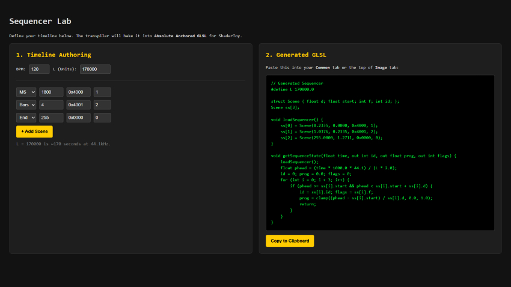

# Orchestrating the Machine: A Generic Sequencer for TS and GLSL

By: Coop (Starfighter & Magnus Thor)  
Category: 🎨 Demoscene & Graphics

**Note:** For demoscene veterans, this approach may be common knowledge. The goal of this post is to provide a clear, practical guide for a wider audience looking to master complex visual timing in their code. That said, we—the authors—believe it is still well worth the read. **And yes, we also used AI.**

To turn a shader into a complex visual performance, you need a **Sequencer**. It is the _Conductor_ that ensures every visual event happens exactly when it should. This system is elastic, bit-packed, and mathematically locked to the rhythm of a song.

Unlike traditional animation timelines, this approach treats time as a **domain**, not a stopwatch — allowing the same logic to run on the CPU, the GPU, or entirely standalone inside a shader.


## 1. The Case for Relative Units

Most beginners use absolute seconds (e.g., “At 10 seconds, do this”). This is intuitive — but **fundamentally brittle**. If you change the BPM, extend an intro, or reorder scenes, every timestamp downstream breaks. Absolute time tightly couples _creative structure_ to _real-world playback_.

### Avoiding the "If-Else" Spaghetti

The most common mistake is building a timeline out of long chains of conditional logic:

```glsl
if(t > 10.0 && t < 20.0) { ... } else if(t > 20.0) { ... }
```

This creates **spaghetti code** almost instantly. Not only is it a nightmare to maintain, but **branching in a shader is expensive**. GPUs prefer deterministic, mathematical flows. By mapping time to a relative domain, we replace dozens of fragile `if` checks with a single, clean lookup that the GPU can process efficiently.

Instead, we treat time as a **domain**, not a stopwatch, and normalize it into **relative units** that scale naturally with BPM, sample rate, and scene structure.

### World Space Time & Playhead

To support this, we define a **World Space constant** — in our case:

```r
L = 170000
```

This constant defines the **resolution of our timeline**. Seconds belong to the browser or OS; **World Space Time belongs to the demo**.

Mathematically, `L` represents the _Total Timeline Duration_ in a fixed unit. By setting `L = 170000`, we are effectively defining a **170-second capacity** (170,000 ms). This value is a careful balance: if `L` is too small, your resolution suffers from floating-point precision issues; if it is too large, you risk hitting the limits of a `float` on certain GPU hardware.

The **playhead**, which tracks progress through the timeline, is computed as:

$${playhead} = \frac{t \times 1000 \times 44.1}{L \times 2}$$


-   `t` = elapsed time in seconds
    
-   `44.1` = sample rate in kHz (44.1 kHz)
    
-   `L` = world space resolution
    

This maps real time into discrete sequencer units. Every scene and effect is now defined in this consistent, relative space.

### Mapping Bars, Beats, and Milliseconds

Let’s define some quantities:

-   `Fs` = sample rate (samples per second, e.g., 44.1 kHz)
    
-   `BPM` = beats per minute
    
-   `BPB` = beats per bar
    

**Samples per beat**:


$${samplesPerBeat} = \frac{Fs \times 60}{BPM}$$


**Samples per bar**:


$${samplesPerBar} = \text{samplesPerBeat} \times BPB$$


**Milliseconds → relative units**:

$${units} = \frac{ms \times Fs}{L \times 2}$$

**Bars → relative units**:

$${units} = \frac{bars \times BPB \times 60 / BPM \times 1000 \times Fs}{L \times 2}$$


> These formulas show how tempo, bar length, and sample rate all scale naturally in **world-space time**.

### Relative Units Decouple Tempo and Structure

-   Doubling `L` slows the entire production uniformly.
    
-   Doubling `BPM` compresses bars into shorter time spans, but scene order and effect timing remain intact.
    
-   Milliseconds and bars collapse into the same sequencer space, usable both on CPU and GPU.
    
This is exactly how musical notation works: a score does not change if you play it faster or slower — only the conductor’s tempo does.

### Think like this

-   `time` → `playhead` → `scene` → `progress` → `flags` → `phase` → `effect`
    
-   Relative units unify perceptual timing (ms), musical structure (bars), and GPU-friendly deterministic sequences.
    
-   Sample rate (`Fs`) acts as the bridge between discrete audio processing and continuous visual timing.
    

By thinking in **relative, world-space time**, we create a system that is **robust, musically coherent, and GPU-native**, while remaining flexible to tempo changes or structural edits.


## 2. The Rhythmic Sequencer Result

This implementation converts **human time** (milliseconds) and **musical time** (beats, bars) into a single **relative sequencer space**.

The timeline itself does not care _where_ time came from — only that it arrives normalized.

This allows you to:

-   Score shaders like sheet music
    
-   Mix perceptual timing with musical structure
    
-   Keep runtime math extremely cheap and GPU-friendly
    


### TypeScript Implementation

```typescript
/**
 * A timeline-based sequencer for managing musical scenes and progress tracking.
 * Handles conversion between different time units and maintains current playback state.
 */
export class Sequencer {
    /** The ID of the currently active scene */
    public currentSceneId: number = 0;
    /** Flags associated with the current scene */
    public currentFlags: number = 0;
    /** Progress within the current scene (0.0 to 1.0) */
    public progress: number = 0; // 0.0 to 1.0 within the scene
    
    /**
     * Creates a new Sequencer instance.
     * @param timeline - Array of scene data where each scene is [duration, flags, sceneId]
     * @param bpm - Beats per minute for musical timing calculations
     * @param beatsPerBar - Number of beats in each bar for musical timing
     */
    constructor(
        private timeline: any[][], 
        public bpm: number = 120,
        public beatsPerBar: number = 4
    ) {}

    /**
    * Converts milliseconds into Relative Units for timeline positioning.
    * Best for intros, breakdowns, FX tails, silence.
    * @param ms - Duration in milliseconds
    * @param totalLength - Total length of the timeline in some reference unit
    * @returns The duration in relative units
    */
    getUnitsFromMs(ms: number, totalLength: number): number {
        return (ms * 44.1) / (totalLength * 2);
    }

    /**
    * Converts musical bars into Relative Units for timeline positioning.
    * Best for grooves, drops, verses, repeating structures.
    * @param bars - Duration in musical bars
    * @param totalLength - Total length of the timeline in some reference unit
    * @returns The duration in relative units
    */
    getUnitsFromBars(bars: number, totalLength: number): number {
        const secondsPerBeat = 60 / this.bpm;
        const secondsPerBar  = secondsPerBeat * this.beatsPerBar;
        return this.getUnitsFromMs(bars * secondsPerBar * 1000, totalLength);
    }

    /**
     * Updates the sequencer state based on the current playback time.
     * Determines which scene is currently active and calculates progress within that scene.
     * @param seconds - Current playback time in seconds
     * @param L - Total length parameter used in unit conversion calculations
     */
    update(seconds: number, L: number): void {
        let playhead = (seconds * 1000 * 44.1) / (L * 2);
        
        let cursor = 0;
        let localTime = playhead;

        while (
            cursor < this.timeline.length - 1 && 
            this.timeline[cursor][0] < 255 && 
            localTime >= this.timeline[cursor][0]
        ) {
            localTime -= this.timeline[cursor++][0];
        }

        const activeScene = this.timeline[cursor];
        this.currentFlags = activeScene[1];
        this.currentSceneId = activeScene[2];
        
        this.progress = Math.min(Math.max(0, localTime / activeScene[0]), 1);
    }
}
```


### Timeline Authoring Pattern

```typescript
const L = 170000;
const seq = new Sequencer([], 120, 4);

/**
* AUTHORING GUIDELINE:
*
* - Use milliseconds for perceptual timing
* - Use bars for musical structure
* - Let the sequencer collapse both into world space
*/
const SS = [
    [seq.getUnitsFromMs(1800, L), 0x4000, 1], // Intro
    [seq.getUnitsFromBars(4, L), 0x4001, 2], // Groove
    [seq.getUnitsFromMs(1200, L), 0x0000, 3], // Breakdown
    [seq.getUnitsFromBars(8, L), 0x4000, 4], // Drop
    [255, 0x0000, 0]                          // End Sentinel
];

```

## 3. Usage in the Animation Loop

```typescript
const sequencer = new Sequencer(SS, 120);

const animate = (timestamp: number) => {
    requestAnimationFrame(animate);
    sequencer.update(timestamp / 1000, L);

    Renderer.render({
        u_time: timestamp / 1000,
        u_progress: sequencer.progress,
        u_flags: sequencer.currentFlags,
        u_sceneId: sequencer.currentSceneId
    });
};

```

The **End Sentinel (`255`)** marks the end of the timeline, ensuring loops always terminate safely. This lets us **bake the timeline directly into GLSL** without adding bounds checks, making GPU iteration simple, safe, and deterministic.


## 4. The GPU Handshake (Uniforms)

```glsl
uniform float u_time;      
uniform float u_progress;  
uniform int   u_flags;     
uniform int   u_sceneId;   

```

These four values fully describe global state.

### Bit-Packed Flags

```glsl
bool isFlagSet(int flag) {
    return (u_flags & flag) != 0;
}

```

The sequencer controls **when**, not **what**.

## 5. The GLSL Transpiler

```typescript
static bakeToGLSL(timeline: any[][]): string {
    let glsl = `struct Scene { float d; int f; int id; };\n`;
    glsl += `Scene ss[${timeline.length}];\n`;

    timeline.forEach((s, i) => {
        glsl += `ss[${i}] = Scene(${s[0].toFixed(4)}, ${s[1]}, ${s[2]});\n`;
    });

    return glsl;
}

```


## 6. Standalone Runtime

Fully runnable GLSL code to run on **Shadertoy**. No CPU. No history. No state.

### Example 1 – Without Beat Pulse

```glsl
#define L 170000.0

struct Scene { 
    float d;
    int f;
    int id;
};

Scene ss[4];

void getSequenceState(float time, out int id, out float prog, out int flags) {
    float phead = (time * 1000.0 * 44.1) / (L * 2.0);

    ss[0] = Scene(0.3243, 0x4000, 1);
    ss[1] = Scene(0.6485, 0x0001, 2);
    ss[2] = Scene(0.1297, 0x4001, 3);
    ss[3] = Scene(255.0, 0, 0);

    float acc = 0.0;
    id = 0; prog = 0.0; flags = 0;

    /* NOTE: On some GPUs, accumulating small floats in a loop (acc += ss[i].d)
    can lead to precision "drift" over long timelines. For production,
    pre-calculate absolute start/end times in your Transpiler. */
    for (int i = 0; i < 4; i++) {
        if (phead >= acc && phead < acc + ss[i].d) {
            id = ss[i].id;
            flags = ss[i].f;
            prog = clamp((phead - acc) / ss[i].d, 0.0, 1.0);
            return;
        }
        acc += ss[i].d;
    }
}

void mainImage(out vec4 fragColor, in vec2 fragCoord) {
    int sId; float sProg; int sFlags;
    getSequenceState(iTime, sId, sProg, sFlags);

    vec3 col = vec3(0.0);
    if (sId == 1) col = vec3(0.8, 0.2, 0.2);
    if (sId == 2) col = vec3(0.2, 0.2, 0.8);
    if (sId == 3) col = vec3(0.2, 0.8, 0.2);

    float fade = smoothstep(0.0, 0.25, sProg) *
                (1.0 - smoothstep(0.75, 1.0, sProg));

    if ((sFlags & 0x4000) != 0) {
        vec2 uv = fragCoord / iResolution.xy;
        col *= 0.5 + 0.5 * pow(16.0 * uv.x * uv.y *
            (1.0 - uv.x) * (1.0 - uv.y), 0.1);
    }

    fragColor = vec4(col * fade, 1.0);
}

```

### Example 2 – With Beat Pulse

```glsl
#define L 170000.0

struct Scene { 
    float d;
    int f;
    int id;
};

Scene ss[4];

void getSequenceState(float time, out int id, out float prog, out int flags) {
    float phead = (time * 1000.0 * 44.1) / (L * 2.0);

    ss[0] = Scene(0.3243, 0x4000, 1);
    ss[1] = Scene(0.6485, 0x0001, 2);
    ss[2] = Scene(0.1297, 0x4001, 3);
    ss[3] = Scene(255.0, 0, 0);

    float acc = 0.0;
    id = 0; prog = 0.0; flags = 0;

    for (int i = 0; i < 4; i++) {
        if (phead >= acc && phead < acc + ss[i].d) {
            id = ss[i].id;
            flags = ss[i].f;
            prog = clamp((phead - acc) / ss[i].d, 0.0, 1.0);
            return;
        }
        acc += ss[i].d;
    }
}

void mainImage(out vec4 fragColor, in vec2 fragCoord) {
    int sId; float sProg; int sFlags;
    getSequenceState(iTime, sId, sProg, sFlags);

    vec3 col = vec3(0.0);
    if (sId == 1) col = vec3(0.8, 0.2, 0.2);
    if (sId == 2) col = vec3(0.2, 0.2, 0.8);
    if (sId == 3) col = vec3(0.2, 0.8, 0.2);

    float fade = smoothstep(0.0, 0.25, sProg) *
                (1.0 - smoothstep(0.75, 1.0, sProg));

    // Example: Pulsating effect driven by flags + beat phase
    if ((sFlags & 0x4000) != 0) {
        /* TIP: Edge Detection. Use sProg to trigger one-time events at 
        the start of a scene, like this flash that decays immediately. */
        float trigger = smoothstep(0.1, 0.0, sProg);
        
        float beatPhase = fract(sProg * 4.0);           // 4 pulses per scene
        float pulse     = sin(beatPhase * 6.28318);    // TAU
        pulse = pulse * 0.5 + 0.5;                      // normalize 0-1
        col *= mix(0.7, 1.3, pulse) + trigger;          // pulse + flash
    }

    fragColor = vec4(col * fade, 1.0);
}

```

## 7. Scene Structure vs. Behavioral Flags

A crucial design choice is the **separation of structure and behavior**.

-   Scenes (`sceneId`) define temporal order — answer: where are we in the composition?
    
-   Flags (`u_flags`) define active behaviors — answer: what is allowed to happen right now?

The sequencer guarantees scenes run **in sequence**. Visual effects do not need to be bound to scene IDs — they are gated by flags and optionally modulated by the scene progress.

### Beat-Synchronous Pulsation (Phase-Based)

```glsl
float beatPhase = fract(sProg * pulsesPerScene);
float pulse     = sin(beatPhase * TAU) * 0.5 + 0.5;
if ((sFlags & PULSE_FLAG) != 0) col *= mix(0.7, 1.3, pulse);

```

> Scenes define time.  
> Flags define behavior.  
> Phase defines rhythm.


## 8. Live Tool: The Sequencer Laboratory

Theory is best paired with practice. We have built a **Sequencer Laboratory** where you can live-author your timelines using this exact logic. Input musical bars or milliseconds, and the tool will generate **Absolute Anchored GLSL** code.

**Try it here:** [https://zw36jp.csb.app/](https://zw36jp.csb.app/)





### The Baked Output

```glsl
// Generated glslcode 
#define L 170000.0

struct Scene { float d; float start; int f; int id; };
Scene ss[3];

void loadSequencer() {
    ss[0] = Scene(0.2335, 0.0000, 0x4000, 1);
    ss[1] = Scene(1.0376, 0.2335, 0x4001, 2);
    ss[2] = Scene(255.0000, 1.2711, 0x0000, 0);
}

void getSequenceState(float time, out int id, out float prog, out int flags) {
    loadSequencer();
    float phead = (time * 1000.0 * 44.1) / (L * 2.0);
    id = 0; prog = 0.0; flags = 0;
    for (int i = 0; i < 3; i++) {
        if (phead >= ss[i].start && phead < ss[i].start + ss[i].d) {
            id = ss[i].id; flags = ss[i].f; 
            prog = clamp((phead - ss[i].start) / ss[i].d, 0.0, 1.0);
            return;
        }
    }
}

```

### Integration in `mainImage`

```glsl
void mainImage(out vec4 fragColor, in vec2 fragCoord) {
    // 1. Extract the current state from the playhead
    int sId; float sProg; int sFlags;
    getSequenceState(iTime, sId, sProg, sFlags);

    // 2. Drive visuals using progress and flags
    vec3 col = vec3(0.0);
    
    // Scene-based color
    if (sId == 1) col = vec3(1.0, 0.5, 0.2); 
    if (sId == 2) col = vec3(0.2, 0.6, 1.0);
    
    // Flag-based behavior (e.g., a fade-in flash)
    float flash = smoothstep(0.1, 0.0, sProg);
    if ((sFlags & 0x4000) != 0) col += vec3(flash);

    fragColor = vec4(col, 1.0);
}

```

## 9. Size-Coding: A tiny Conductor

For those in the **size-coding** community, the "Relative Domain" logic is a goldmine because it can be compressed into a tiny, branchless loop. We can pack both the **Scene ID** and **Control Flags** into a single float to keep the array slim.

> **Note:** We are not expert size-coders, code golfers, or crunchers, so please keep that in mind. We also highly recommend reading Måten Rånges’s article published the 13th of december : _“[Disassembling a Compact Glow-Tracer](https://github.com/MagnusThor/so-you-think-you-can-code-2025/blob/main/day13/readme.md)”_ —it is an absolute masterpiece.

```glsl
// s.xyz = duration, start, packed(id + flags)
// We pack ID in the 1s place and Flags in the 10s place.
// Example: 31.0 = Scene ID 1 + Flag 3
vec3 s[4] = vec3[](
    vec3(1.94, 0, 11),   // Sc 1: 15s (ID 1, Flag 10)
    vec3(1.94, 1.94, 2), // Sc 2: 15s (ID 2, No Flags)
    vec3(1.94, 3.88, 33),// Sc 3: 15s (ID 3, Flag 30)
    vec3(255, 5.82, 0)   // Blackout sentinel
);

void mainImage(out vec4 O, vec2 U) {
    // p = Playhead: Current time mapped to World Space
    float p = iTime * .13, t; 
    
    // O *= 0.0 is the shortest way to initialize fragColor to black
    O *= 0.; 
    
    for(int i=0; i<4; i++) {
        vec3 v = s[i];
        
        // Check if the current playhead is within this scene's window
        if (p >= v.y && p < v.y + v.x) {
            
            // Calculate local progress (0.0 to 1.0) within the active scene
            t = (p - v.y) / v.x;
            
            // Decode packed float: Modulo gets the ID, Division gets the Flag
            int id = int(v.z) % 10;   
            int fl = int(v.z) / 10;   

            // Golfed scene selection using a nested ternary chain
            O = id < 1 ? O*0. : 
                id < 2 ? vec4(1,.5,.2,1) : 
                id < 3 ? vec4(.2,.6,1,1) : vec4(.2,.8,.2,1);
            
            // Behavior: If Flag > 0, apply a rhythmic pulse modulation
            if(fl > 0) O *= sin(t * 31.4) * .5 + .5; 
            
            // Visual accent: Add a white flash that decays at scene start
            O += smoothstep(.2, 0., t); 
        }
    }
}

```

### Tricks Applied:

-   **Float Packing:** By using `11` for "ID 1 with Flag 10," we avoid needing a second array or a `vec4`. Simple division and modulo are the cheapest ways to decode state in restricted environments.
    
-   **Multiplier Collapse:** Rounding the playhead multiplier to `.13` saves bytes over using the full `.1297`. In a 1k intro, precision is often traded for space.
    
-   **Zeroing Output:** `O *= 0.` is a standard size-coding idiom. It clears any garbage data in the output vector using fewer characters than an assignment.
    
-   **The Progress Formula:** `t = (p - v.y) / v.x` is the heart of the system—it transforms global time into a local `0.0-1.0` ramp used for all animations and easing.


## Conclusion: Scoring the Machine

This sequencer is not about triggering effects — it is about **orchestrating behavior**.

By treating time as a world space, scenes as relative durations, flags as behavior toggles, and progress as phase, we gain a system that is:

-   Musically intuitive
    
-   Mathematically robust
    
-   GPU-native
    
-   Immune to refactors and tempo changes
    

The shader does not merely react to time — it performs it.

The GPU is not just rendering pixels — it is reading a score.

And the sequencer is the conductor. 🎼

----------

_Thanks for your time._
```